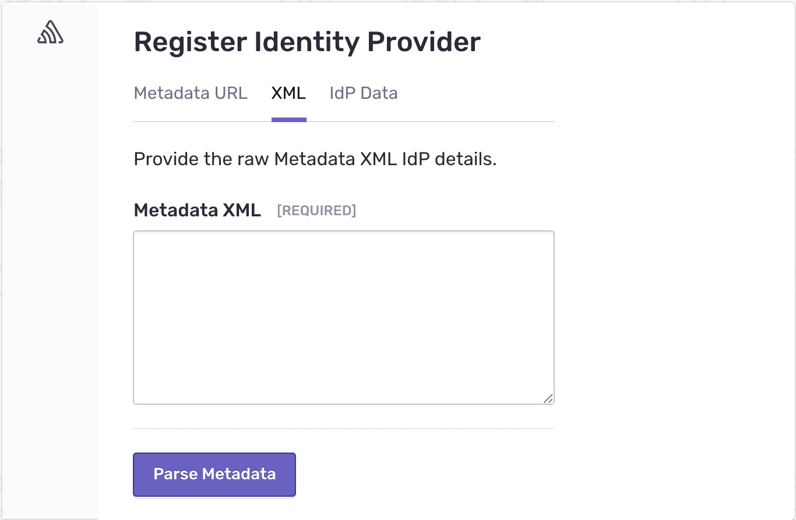

# Configuring SAML Single Sign-On

This guide aims to give you some ideas about configuring the SAML SSO for your tenants and the best practices you can follow while
implementing the same.

## SSO connection identifier

A multi-tenant enterprise app must attach SSO connections to a **tenant identifier**. For example, an app can use any of the
following as its tenant identifier.

- Email domain
- Organization Id or Organization slug
- Team Id or Team slug
- Other unique identifiers

Typically, the app asks users to enter their tenant identifier to initiate the authentication flow. Then the app tries to find the
proper SSO connection based on the tenant identifier. Finally, the app redirects users to their Identity Provider if a valid SSO
connection is found, or the app displays an appropriate error message if the connection is not found.

If your app asks for the work email address, it must extract the domain part and use it as the tenant identifier.

Let's see what other apps use to identify the SSO Connections:

- Airtable uses the Email domain
- Vercel uses the Team slug
- Netlify uses the Team Id
- Sentry uses the Organization Id

Read more about [UI Best Practices for login with SAML Single Sign-On](login-with-saml-sso.mdx).

## SSO settings UI

An app should allow each tenant to configure SAML SSO for their users.

Depending on your application's tenant architecture, you can put the SAML SSO configuration page under the organization or team
settings page.

Since the SAML SSO is an exclusive security-facing feature for enterprises, the best place to put the configuration page is under
the **Security** tab.

Here is how Sentry does the SAML SSO configuration for their customers.

To create an [SSO connection with Ory Polis](../sso-flow/#2-sso-connection-api), you must pass the tenant identifier, product
name, and XML metadata. So your settings page UI must display a form to capture the XML Metadata.

Typically, an Administrator user with a higher privilege does the SAML SSO configuration for their tenant.

## Additional SSO settings

You can consider a few additional settings while implementing the SAML SSO into your app.

**Enforcing SAML**

For additional security, SAML SSO can be enforced for a tenant so that all tenant members must authenticate via an identity
provider (IdP).

**Default role**

Allow the tenants to choose a default role. Every member who creates a new account via SSO will be assigned the default role that
has been set.
