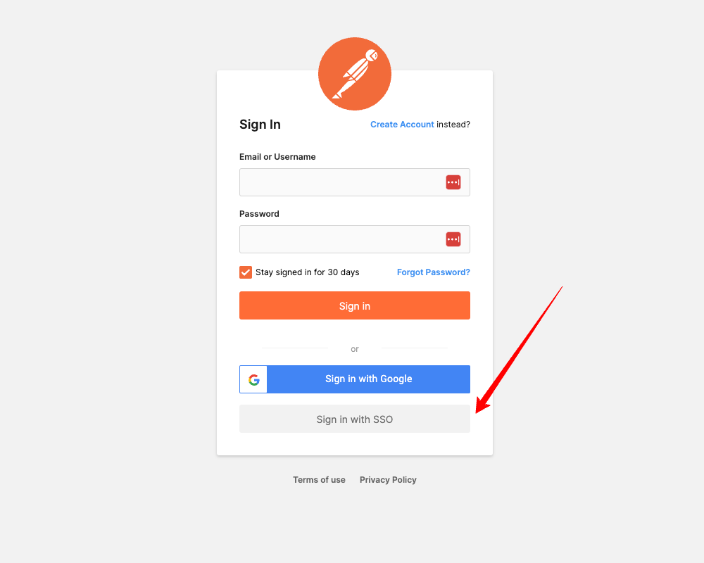
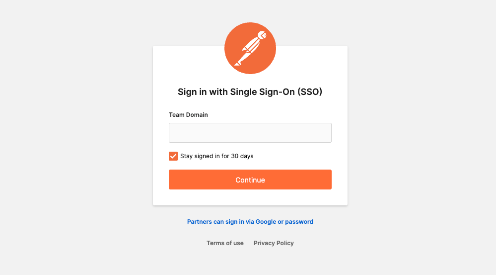
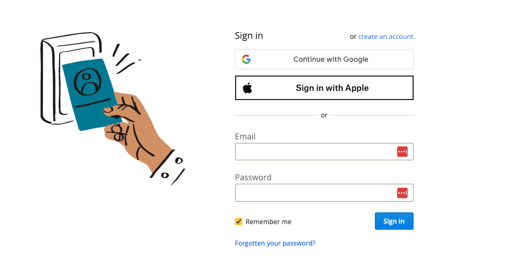
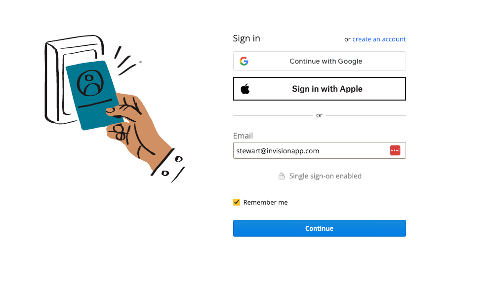
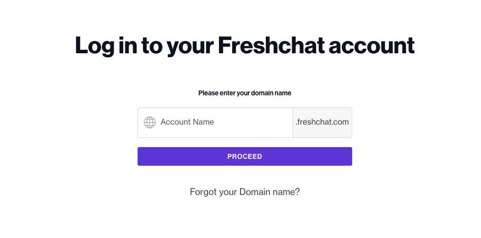
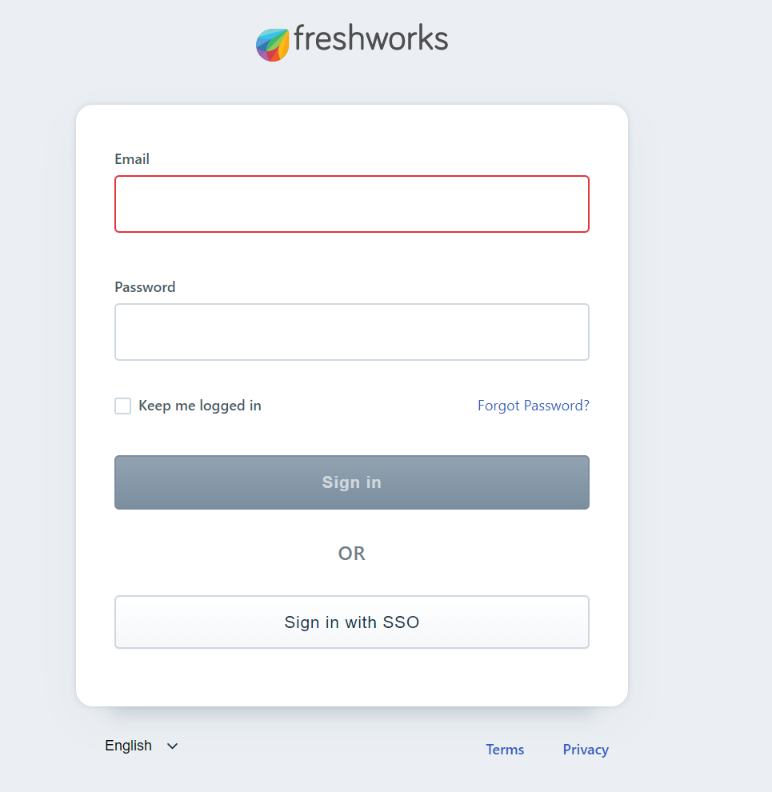
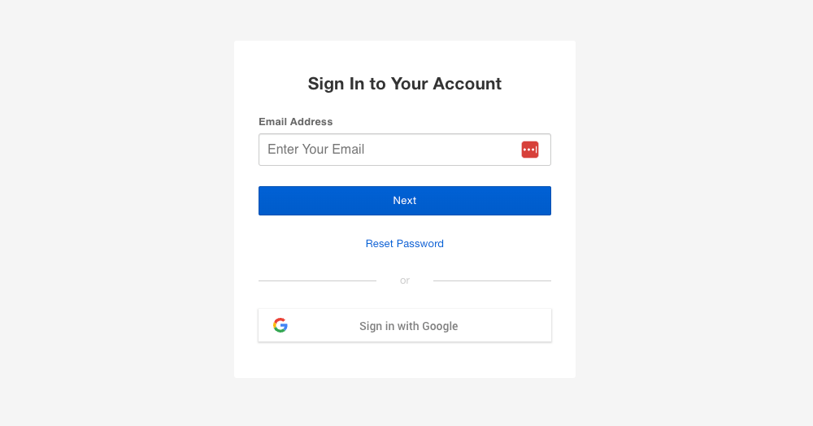

# Log in with SAML Single Sign-On

Let's see how enterprise apps have implemented the SAML SSO into their authentication flow.

## Service Provider Initiated SSO

You can use several approaches while implementing your app's SP-initiated SAML SSO login.

- Dedicated page for SAML SSO
- Dynamic password fields
- Subdomain for tenants
- Separate the email and password fields

### Dedicated page for SAML SSO

With this approach, you would put a button on your login page for `Login with SAML SSO`. Users are taken to the SAML SSO page when
they click the button.

**Postman** takes this approach to enable SAML SSO for their enterprise users.

The user flow would be something similar to the one below.

- Users visit the login page.
- Click the button "Login with SAML SSO"
- The app redirects the user to the SAML SSO page.
- The user enters their email address or tenant ID.
- The app examines the domain or tenant ID to see if SSO is enabled.
- If SSO is enabled, the app redirects the user to their IdP.

### Dynamic password fields

This approach hides the password field if SSO is enabled for a domain.

You can see this approach on the **Dropbox** login form.

The user flow would be something similar to the one below.

- Users visit the login page.
- The user enters their email address.
- The app examines the domain to see if SSO is enabled.
- If SSO is enabled, the app hides the password field from the login form.
- The user submits the login form.
- The app redirects the user to their IdP.

### Subdomain for tenants

One approach you can take is to configure a subdomain for each tenant. First, display a form to enter the tenant ID, and then the
application redirects users to the subdomain page to show the available authentication mechanism enabled for the tenant.

You can see this approach on the **Freshchat or Freshworks** login form.

The user flow would be something similar to the one below.

- Users visit the login page.
- The user enters their tenant name.
- The app examines the tenant's existence and redirects the user to the tenant's subdomain page.
- The subdomain page display a login form with the authentication mechanisms enabled for the tenant.
- If SSO is enabled, the user can choose "Login with SAML SSO".

### Separate the email and password fields

This approach splits the login process into multiple stages. First, the login form displays an email field without a password
field. Next, a user enters their email address, and the application checks to see which authentication mechanism is enabled for
the current user.

**Box** uses this approach for its authentication flow.

The user flow would be something similar to the one below.

- Users visit the login page.
- The user enters their email address and submit the login form.
- The app examines the email address to see if SSO is enabled.
- If SSO is enabled, the app redirects the users to their IdP instead of taking them to a password flow.
