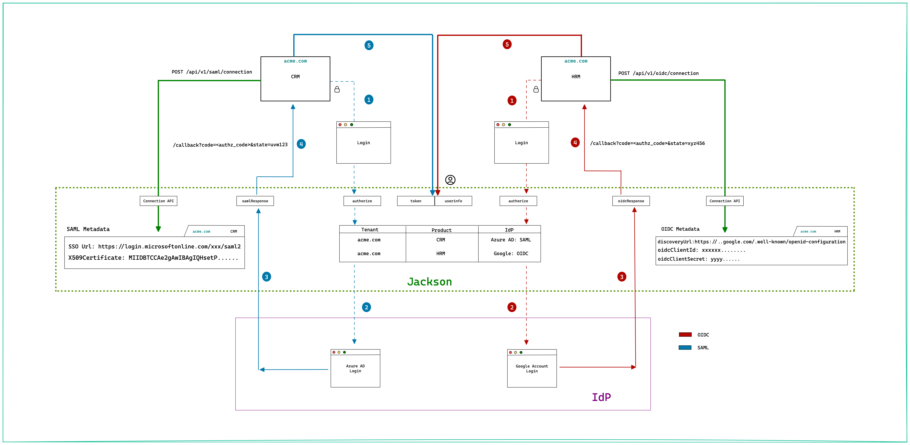

Let's say you have a customer `acme.com` who is using two of your SaaS offerings. For now let's call them:

- `CRM (Customer Relationship Management)` - Should integrate with the customer (of acme.com) facing SAML Identity Provider (Azure
  AD)
- `HRM (Human Resource Management)` - Should integrate with the Google workspace account of `acme.com` employees.

Let's see how SSO works in this case.

## Configure the SSO connection

First as the application developer, you'll need to [add](./index.mdx#add-connection) the SSO connections for CRM and HRM. This
will be saved (marked as SAML Metadata and OIDC Metadata in the below diagram) within Ory Polis and later used to orchestrate the
IdP login.

## Login flow

Ory Polis uses the Authorization Code flow as outlined by the numbered steps below.

1. The Client (Browser app) initiates the login by redirecting to Ory Polis [`authorize`](./index.mdx#authorize) endpoint. Ory
   Polis will parse the tenant/product in the request and use it to redirect the user to the configured IdP.
2. Step 2 varies based on the Identity Provider type. For SAML IdP, Ory Polis would construct the SAML request, sign it and send
   it to IdP. The IdP validates the request and redirects the user to the login screen. For OIDC IdP, Ory Polis constructs an
   OpenID Connect request and redirects the user to the OIDC Provider authorization endpoint.
3. Once the user is logged in successfully, the IdP redirects back to Ory Polis. For SAML, the response contains the user profile.
   In the case of OIDC, the response contains the authorization code that is used by Ory Polis to obtain token and userprofile
   from the OIDC IdP. Ory Polis generates a short lived code and stores the user profile against it.
4. The authorization code generated in the previous step is sent to the client app.
5. The client [`exchanges`](./index.mdx#code-exchange) the code for token and uses it to query the
   [`userInfo`](./index.mdx#profile-request) endpoint of Ory Polis to get the complete user profile.

