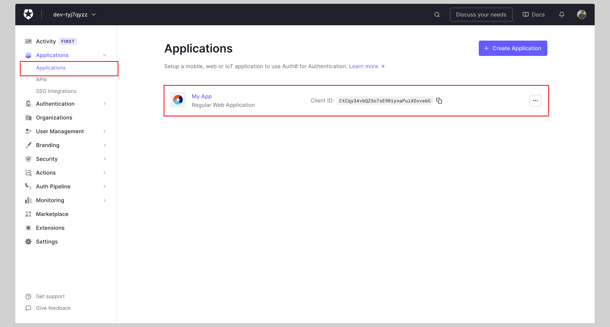
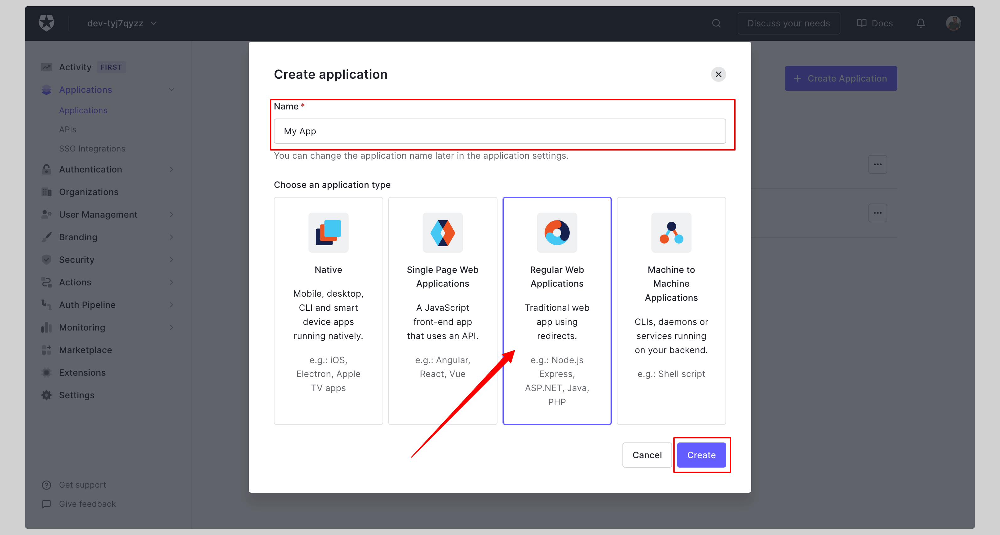
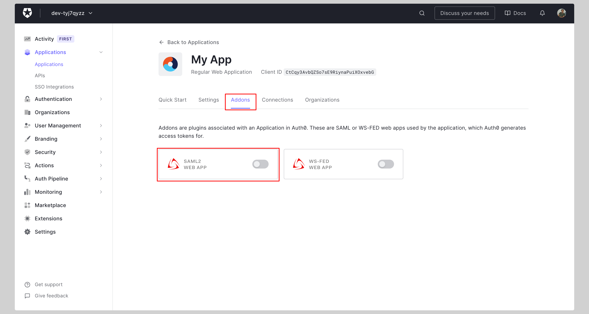
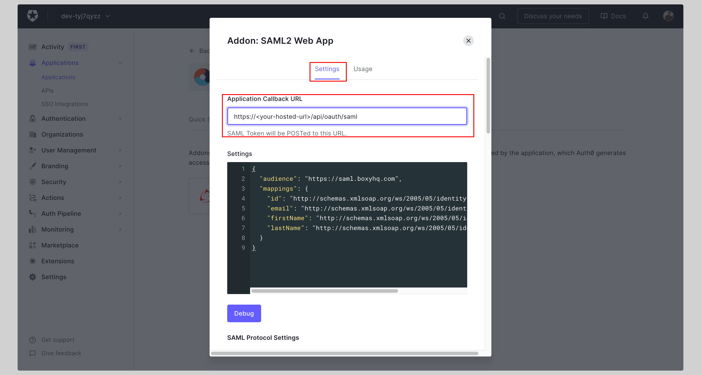
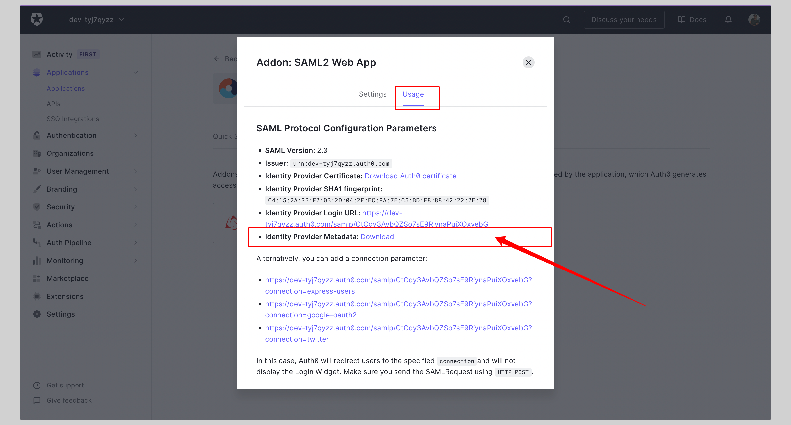

# Auth0 SAML SSO

In this section, we will show you how to set up your own custom SAML application for Auth0 SAML.

## Create application

From your Auth0 dashboard, click **Applications** from the left navigation menu.

If your application is already created, choose it from the list and move to the section
[Configure Application](#configure-application)

If you haven't created a SAML application, click the **Create Application** button to create a new application.

Give your application a **Name** and click **Create**.

## Configure application

Click the tab **Addons** and enable **SAML2 WEB APP** add-on.

Enter your **Application Callback URL** on the next screen and click **Enable**.

Replace the values with the ones you have received from Ory Polis.

Click the tab **Usage** and download the **Identity Provider Metadata**.

## Attribute mapping

No additional attribute mapping is required for Auth0 SAML to work with Ory Polis.

## Next steps

You've successfully configured your custom SAML application for Auth0 SAML. At this stage, you can assign users to your
application and start using it.
