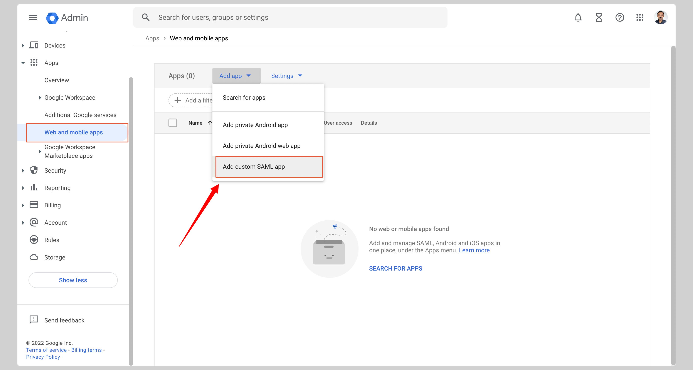
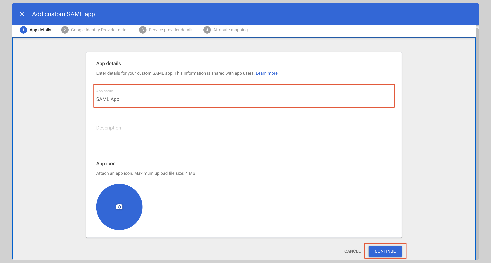
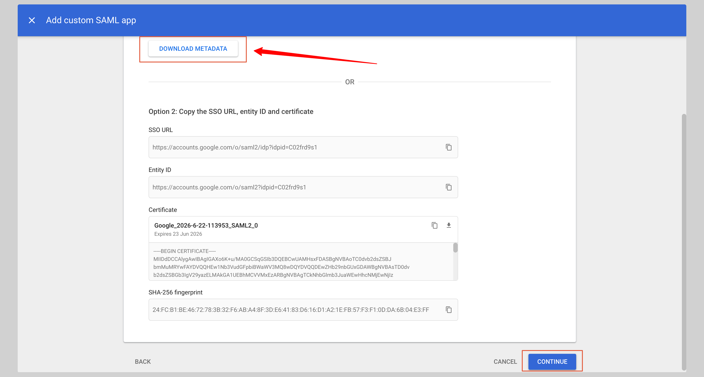
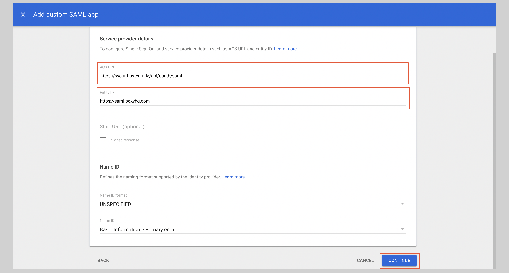
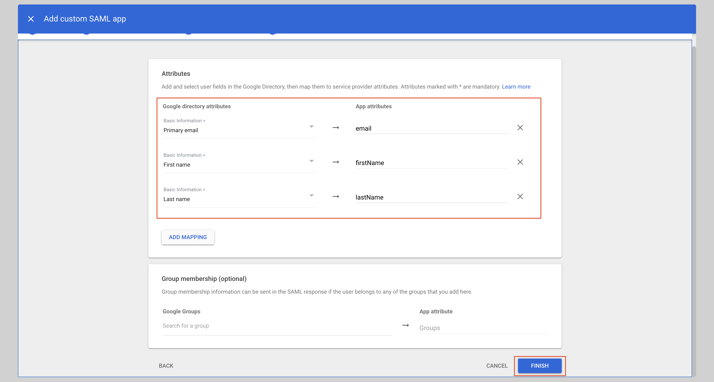
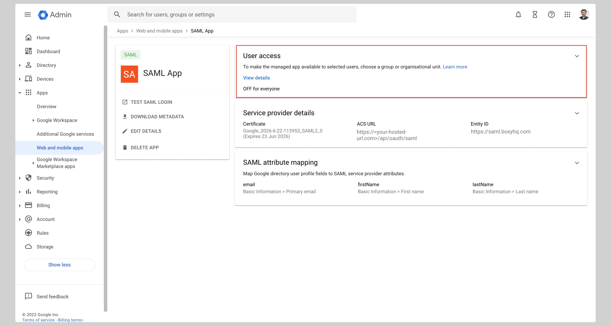
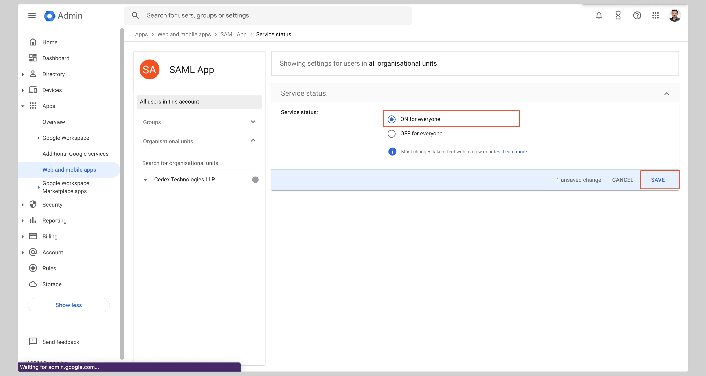

# Google SAML SSO

In this section, we will show you how to set up your own custom SAML application for Google SAML.

## Create application

From your Google Admin console, click **Apps** from the sidebar then click **Web and mobile apps** from the list.

If your application is already created, choose it from the list and move to the section
[Configure Application](#configure-application)

If you haven't created a SAML application, click **Add custom SAML app** from the menu.

Give your application an **App name** and click **Continue**.

## Configure application

From the next screen, click **DOWNLOAD METADATA** to download the metadata XML file, then click **Continue**.

Enter the following values in the **Service provider details** section:

- **ACS URL**
- **Entity ID**

Replace the values with the ones you have received from Ory Polis and click **Continue** to save the configuration.

## Attribute mapping

Under the **Attributes** section, you have to configure the following attributes:

| App attributes | Google directory attributes |
| -------------- | --------------------------- |
| email          | Primary email               |
| firstName      | First name                  |
| lastName       | Last name                   |

See the screenshot below.

After you have configured the attributes, click **Finish** to save the configuration.

From the next screen, click **User access** to configure the application to allow users to log in.

Check the **ON for everyone** checkbox and click **Save**.

## Next steps

You've successfully configured your custom SAML application for Google SAML. At this stage, you can assign users to your
application and start using it.
