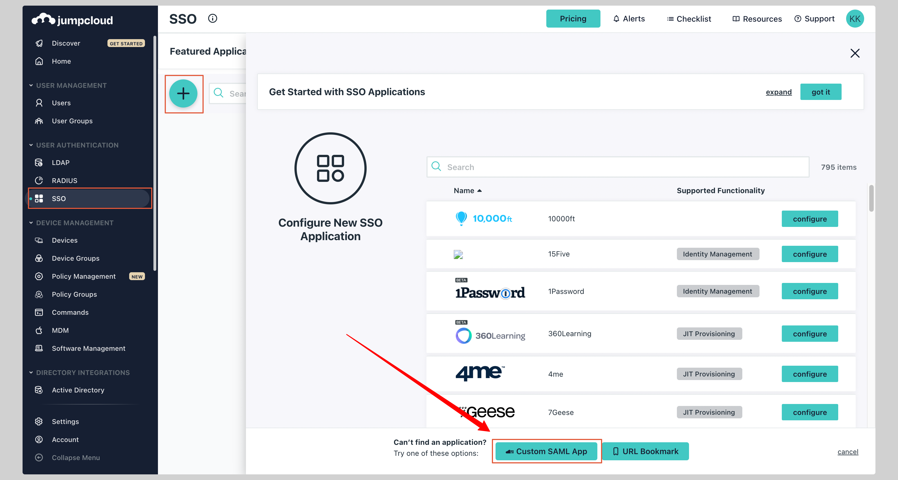
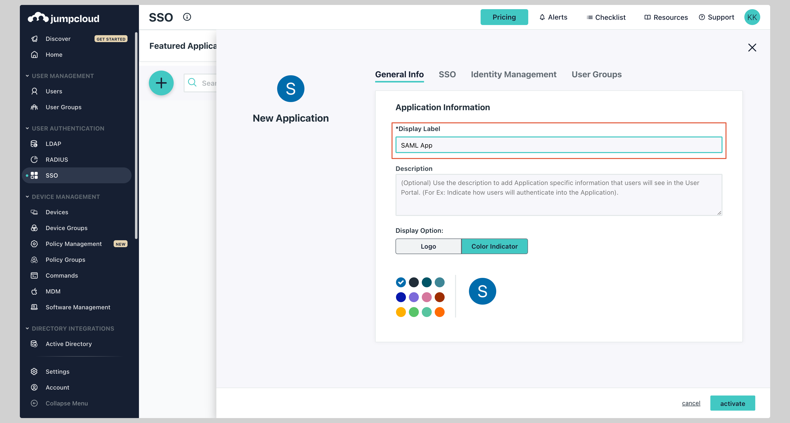
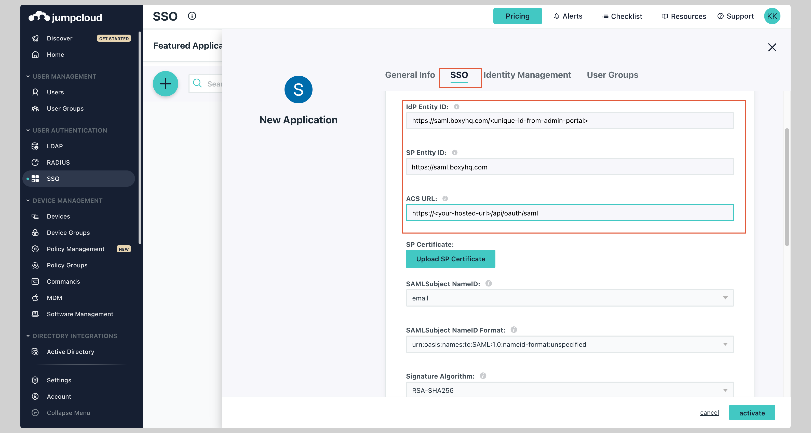
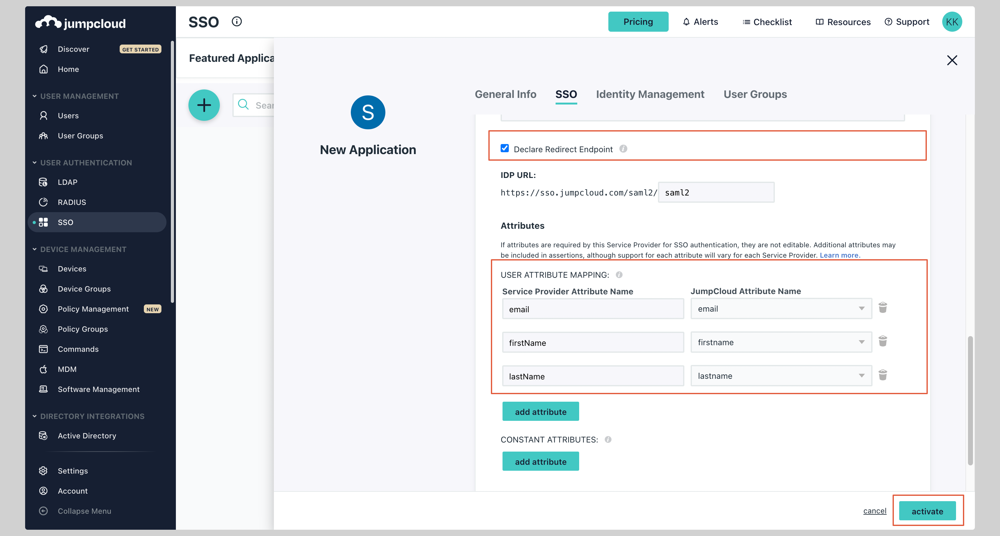
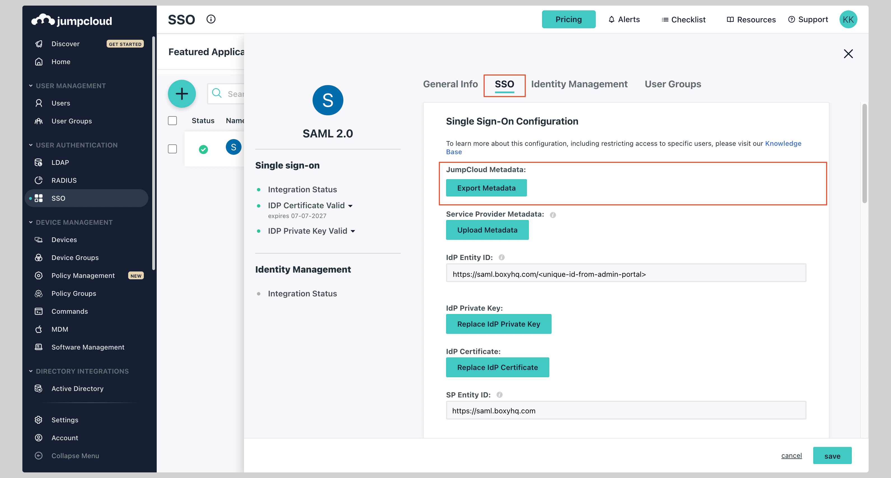

# JumpCloud SAML SSO

In this section, we will show you how to set up your own custom SAML application for JumpCloud SAML.

## Create application

From your JumpCloud Admin console, click **SSO** from the left navigation menu.

If your application is already created, choose it from the list and move to the section
[Configure Application](#configure-application)

If you haven't created a SAML application, click plus icon and then **Custom SAML App** to create a new application

Give your application a **Display Label**.

## Configure application

Next click on the **SSO** tab and enter the following values:

- **IdP Entity ID**
- **SP Entity ID**
- **ACS URL**

Replace the values with the ones you have received from Ory Polis.

## Attribute mapping

Under the **Attributes** section, you have to configure the following attributes:

See the screenshot below.

| Service Provider Attribute Name | JumpCloud Attribute Name |
| ------------------------------- | ------------------------ |
| email                           | email                    |
| firstName                       | firstname                |
| lastName                        | lastname                 |

Make sure you have checked the **Declare Redirect Endpoint** checkbox.

Finally, click **Activate** to save the application configuration.

Now go back to the SAML app you just created, click the tab **SSO**, and click the button **Export Metadata** to download the
metadata XML file.

## Next steps

You've successfully configured your custom SAML application for JumpCloud. At this stage, you can assign users to your application
and start using it.
