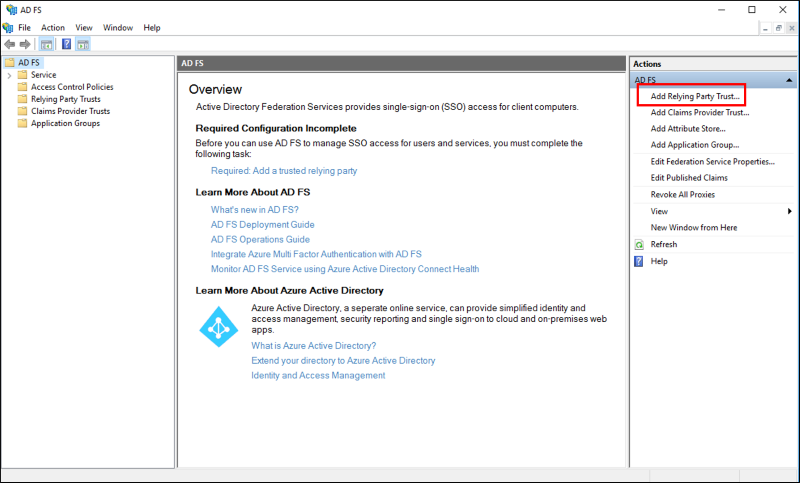
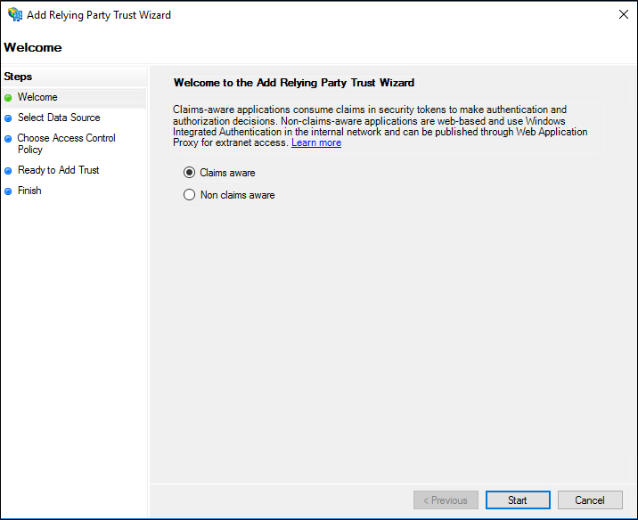
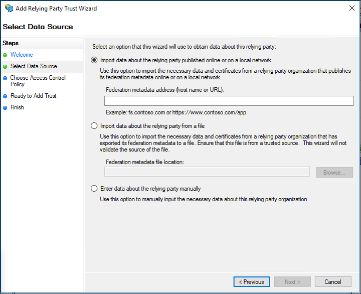
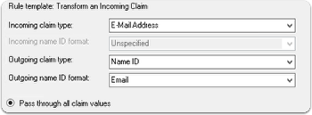

# Microsoft AD FS SAML SSO

In this section, we will show you how to set up your own custom SAML application for Microsoft AD FS.

In AD FS, a relying party (RP) trust needs to be set up. You can supply an Ory Polis SP metadata file, usually located at
`https://<your-hosted-url>/.well-known/sp-metadata` and let AD FS automatically pick up the configuration.

If you are manually entering the details then you'll find the details you need in [this section](./generic-saml.mdx). The public
certificate is needed for Signature verification and is usually located at `https://<your-hosted-url>/.well-known/saml.cer` for
Signature verification.

You will also need to map some attributes of the claims so we can fetch the profile information for your user.

## Create a claims aware Relying Party Trust using federation metadata

1. In Server Manager, click Tools, and then select AD FS Management.
2. Under Actions, click Add Relying Party Trust. 
3. On the Welcome page, choose Claims aware and click Start.
   
4. On the Select Data Source page, click Import data about the relying party published online or on a local network. In Federation
   metadata address (host name or URL), type the federation metadata URL or host name for the partner, and then click Next.
   
5. On the Specify Display Name page type a name in Display name, under Notes type a description for this relying party trust, and
   then click Next.
6. On the Choose Issuance Authorization Rules page, select either Permit all users to access this relying party or Deny all users
   access to this relying party, and then click Next.
7. On the Ready to Add Trust page, review the settings, and then click Next to save your relying party trust information.
8. On the Finish page, click Close. This action automatically displays the Edit Claim Rules dialog box.
9. **Mapping attributes**: On the Configure Claim Rule screen, enter a Claim Rule Name of your choice, select Active Directory as
   the Attribute Store, then add the following mapping:

- From the LDAP Attribute column, select `E-Mail-Addresses`. From the Outgoing Claim Type, type `E-Mail Address`.
- From the LDAP Attribute column, select `Given-Name`. From the Outgoing Claim Type, type `Given Name`.
- From the LDAP Attribute column, select `Surname`. From the Outgoing Claim Type, type `Surname`.
- From the LDAP Attribute column, select `User-Principal-Name`. From the Outgoing Claim Type, type `Name ID`.

10. **Transform Rule**: Create a transform rule mapping the incoming `Email-Address` to outgoing `NameID` (of type `Email`), ADFS
    by default sends `NameID` as `Unspecified` which results in an `InvalidNameIDPolicy` error if this step is missed.



If you'd rather use Claim rule language then the following rule can be applied:

```sh
c:[Type == "http://schemas.xmlsoap.org/ws/2005/05/identity/claims/emailaddress"] => issue(Type = "http://schemas.xmlsoap.org/ws/2005/05/identity/claims/nameidentifier", Issuer = c.Issuer, OriginalIssuer = c.OriginalIssuer, Value = c.Value, ValueType = c.ValueType, Properties["http://schemas.xmlsoap.org/ws/2005/05/identity/claimproperties/format"] = "urn:oasis:names:tc:SAML:1.1:nameid-format:emailAddress");
```

11. Finally open Windows PowerShell as an administrator, then run the following command:

```sh
 Set-ADFSRelyingPartyTrust -TargetName <display-name> -SamlResponseSignature "MessageAndAssertion"
```
