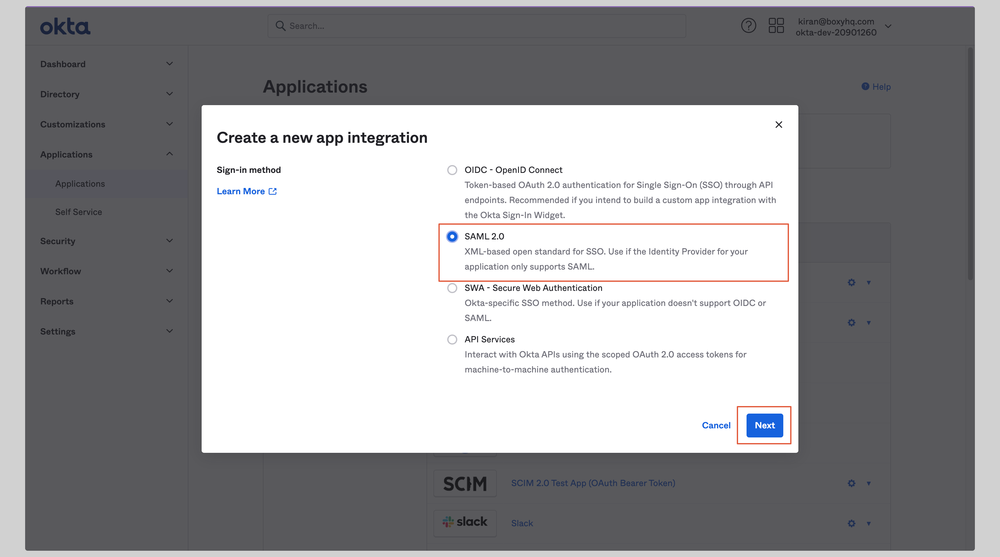

# Okta SAML SSO

In this section, we will show you how to set up your own custom SAML application for Okta SAML.

## Create application

From your Okta account, click **Applications** from the left navigation menu.

If your application is already created, choose it from the list and move to the section
[Configure Application](#configure-application)

If you haven't created a SAML application, click the **Create App Integration** button to create a new application.

Choose **SAML 2.0** from the next screen and click **Next**.

Give your application an **App Name** and click **Next**.

## Configure application

Enter the following values in the **SAML Settings** section on the next screen:

- **Single sign on URL**
- **Audience URI (SP Entity ID)**
- Select **EmailAddress** from the **Name ID format** dropdown.

Replace the values with the ones you have received from Ory Polis.

## Attribute mapping

Under the **Attribute Statements** section, you have to configure the following attributes:

| Name      | Value          |
| --------- | -------------- |
| id        | user.id        |
| email     | user.email     |
| firstName | user.firstName |
| lastName  | user.lastName  |

See the screenshot below.

On the next screen select **I'm an Okta customer adding an internal app** and click **Finish**.

From your application, click **Sign On** tab and go to the section **SAML Signing Certificates**

Click the **Actions** dropdown for the correct certificate and click **View IdP metadata**. A separate window will open with the
metadata XML file, you can copy it to your clipboard.

## Next steps

You've successfully configured your custom SAML application for Okta SAML. At this stage, you can assign users to your application
and start using it.
