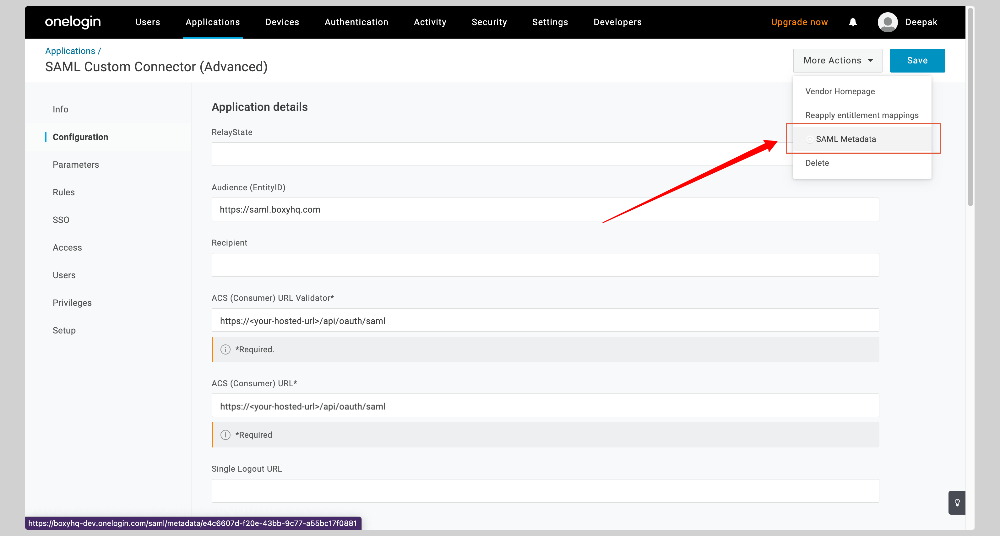
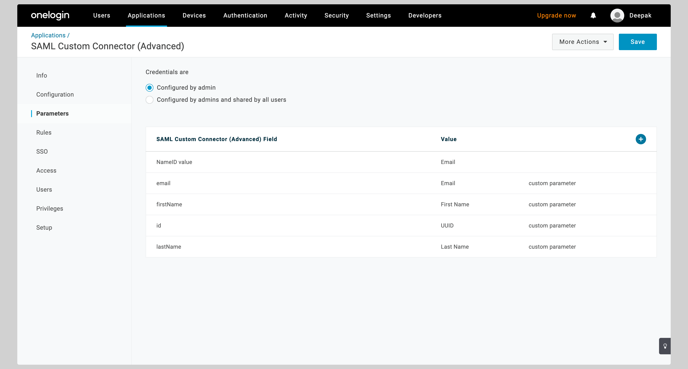

# OneLogin SAML SSO

In this section, we will show you how to set up your own custom SAML application for OneLogin SAML.

## Create application

From your OneLogin account, click **Applications** from the top navigation menu.

If your application is already created, choose it from the list and move to the section
[Configure Application](#configure-application)

If you haven't created a SAML application, click the **Add App** button to create a new application.

Search for **SAML Test Connector** in the **Find Applications** section. Select **SAML Custom Connector (Advanced)** from the
search results.

Give your application a **Display Name** and click **Save**.

## Configure application

From your application, click the **Configuration** tab on the left to configure the application.

You have to enter the following values in the **Application details** section:

- **Audience (Entity ID)**
- **ACS (Consumer) URL Validator**
- **ACS (Consumer) URL**
- Select the **Service Provider** from the **SAML initiator** dropdown.

Replace the values with the ones you have received from Ory Polis.

Click **Save** to save the configuration.

Click the dropdown menu **More Actions** from the top right corner and click **SAML Metadata** to download the metadata XML file.

## Attribute mapping

From your application, click the **Parameters** tab on the left.

You have to configure the following attributes:

| SAML Custom Connector Field | Value      |
| --------------------------- | ---------- |
| id                          | UUID       |
| email                       | Email      |
| firstName                   | First Name |
| lastName                    | Last Name  |

See the screenshot below.

See the below screenshot to see how to map the **id** attribute to **UUID**.

Enter **id** in the **Field name** input and check the **Include in SAML assertion** checkbox. Click **Save** to continue.

On the next screen, select **UUID** from the **Value** dropdown and click **Save**.

Do the same for the other attributes (email, firstName, lastName).

## Next steps

You've successfully configured your custom SAML application for OneLogin SAML. At this stage, you can assign users to your
application and start using it.
