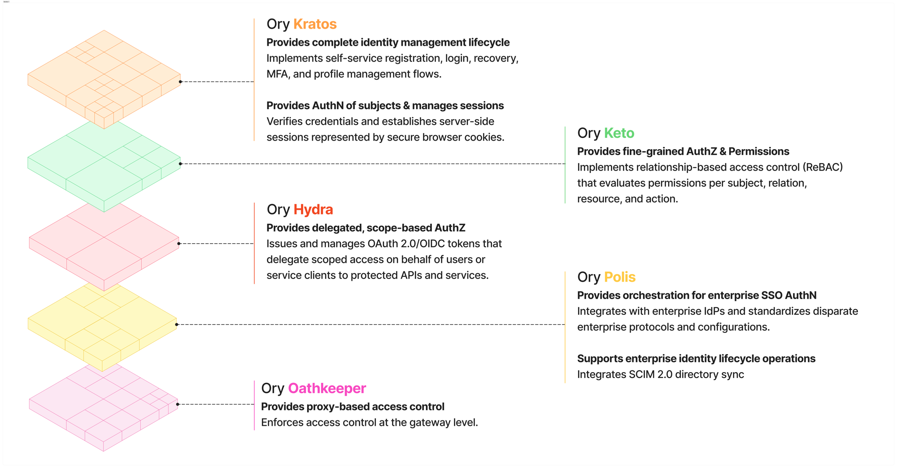

import Link from "@docusaurus/Link"
import WelcomePageSection from "@site/src/components/Welcome/welcome"
import * as welcomeContent from "@site/src/pages/_assets/welcome-content"

Ory's identity and access management platform is modular; each product handles a specific capability, and you combine them based
on what your system needs. This section walks you through choosing the right deployment option for your system, understanding what
each Ory product does, and seeing how products combine into solutions that address real-world authentication and authorization
requirements.

## Which deployment option?

The right option depends on your organization’s goals and how much control you want over your infrastructure. If you need to
maintain full control, meet strict compliance requirements, or operate at massive scale, Ory Enterprise License (OEL) is the best
fit. For teams that want zero infrastructure management and seamless scaling, Ory Network provides a fully managed platform. And
if you’re exploring, testing, or building prototypes, start with Ory Open Source or the Ory Network free tier. All Ory deployment
options share the same open standards and APIs, so you can move between them without rewriting your code.

<WelcomePageSection {...welcomeContent.deploymentOptions} />

## Which Ory product?

Each Ory deployment option, provides everything you need to build a modern identity and access management system. Ory doesn't
treat IAM as one monolithic system, we approach is as a set of layered responsibilities. Here’s how Ory maps core IAM concepts to
our products, each acting as a composable building block.

NOTE: Product names, features, and capabilities may vary between deployment options. The product descriptions below apply
generally across all deployments.

### The Ory ecosystem

### Match your IAM challenge to an Ory product

Choose Ory products based on the specific identity, authorization, or access control challenge you’re solving.

| **IAM Concept / Layer**                               | **Core IAM Question**                                                         | **Ory Product — What it does and how**                                                                                                                                                                                 |
| ----------------------------------------------------- | ----------------------------------------------------------------------------- | ---------------------------------------------------------------------------------------------------------------------------------------------------------------------------------------------------------------------- |
| Identity Management & Authentication                  | Who is the user and how do they sign in?                                      | **Ory Kratos** Manages user identities and handles direct authentication flows such as login, registration, account recovery, MFA-ready flows, and session management (cookies/jwt).                                   |
| Fine-grained Authorization & Permissions              | Can this user perform this action on this specific resource?                  | **Ory Keto** Provides relationship-based, fine-grained authorization for application-level permissions, such as access to documents, projects, or business objects.                                                    |
| Delegated, Scope-based Authorization & Token Issuance | Which application can act on behalf of a user, and with what level of access? | **Ory Hydra** Implements OAuth2 and OpenID Connect to issue access and ID tokens with scopes. Delegates user login to Kratos or another IdP, enabling SSO and API access across apps and services.                     |
| Enterprise Federation & Single Sign-On (SSO)          | How can enterprise customers sign in with their corporate identity provider?  | **Ory Polis** Provides enterprise SSO by connecting apps to SAML and OIDC identity providers. Bridges legacy SAML into modern OAuth2 flows and supports SCIM directory sync for automated user and group provisioning. |
| Proxy Access Control (Enforcement)                    | Should this request be allowed to reach the API right now?                    | **Ory Oathkeeper** Acts as a proxy-based enforcement layer in front of APIs and services, validating credentials and applying authorization decisions before traffic reaches your application.                         |

## From products to solutions

Each Ory product solves a specific IAM challenge, but most real-world implementations combine several. Below are common product
combinations that demonstrate Ory's modular approach to building IAM solutions. These are example combinations and do not
represent all possibile scenerios.

 **Authentication & access control for your applications (Kratos & Keto)** 

Users register and sign in through Kratos, while Keto controls what they can see and do based on roles, relationships, or custom
rules. Use this combination when your application needs both identity management and fine-grained permissions.

1. User attempts to access client app; client app requests a login flow from Ory Kratos.
2. Ory Kratos returns a login flow ID.
3. User submits credentials; client app forwards credentials with flow ID to Ory Kratos.
4. Ory Kratos authenticates and returns a session cookie/token.
5. Client app attaches session cookie/token to subsequent requests.
6. Backend verifies session with Ory Kratos (gets user identity).
7. User creates a protected document; backend grants the user access to this document and writes permission to Ory Keto.
8. User attempts to access a previously protected document; backend requests permission look up in Ory Keto; Ory Keto verifies if
   the user has permission to access the document and sends a response to allow or deny.

**Authentication & delegated access across apps and services (Kratos & Hydra)**

Users authenticate through Kratos, and Hydra issues standards-based OAuth2/OIDC tokens that enable single sign-on and let
applications act on users' behalf with scoped access. Use this combination when you need a shared identity across multiple apps,
third-party integrations, or API access.

1. User attempts to access client app; client app requests an standards-based OAuth2 authorization code flow by redirecting the
   request to Ory Hydra.
2. Ory Hydra redirects to Ory Kratos for user authentication.
3. Ory Kratos authenticates the user (login and/or MFA). On success, Ory Kratos notifies Ory Hydra.
4. Ory Hydra presents a consent screen; user approves requested scopes/permissions.
5. Ory Hydra issues an standards-based OAuth2 authorization code to the client app.
6. The client app exchanges the standards-based OAuth2 authorization code with Ory Hydra for tokens (access, refresh, ID tokens).
7. The client sends the access token on requests to your backend/API (resource server).
8. The backend validates the access token with Ory Hydra (via introspection or JWT validation). Ory Hydra detects the 'openid'
   scope was requested and granted, and responds with an ID token in addition to the access token. Scopes in token govern what is
   allowed.
9. User attempts to access a different client app; subsequent apps reuse the existing session and go straight to consent (unless
   explicitly forced to re-authenticate).
10. User creates a protected document; backend grants the user access to this document and writes permission to Ory Keto.
11. User attempts to access a previously protected document; backend requests permission look up in Ory Keto; Ory Keto verifies if
    the user has permission to access the document and sends a response to allow or deny.

**Authentication, SSO, & fine-grained access control (Kratos, Hydra & Keto)**

Combines user authentication, token-based SSO and delegated access, and granular permission checks into a single stack. Use this
combination when your system needs to manage who users are, which apps can act for them, and exactly what they're allowed to do.

1. User attempts to access client app; client app requests a standards-based OAuth2 authorization code flow by redirecting the
   request to Ory Hydra.
2. Ory Hydra redirects to Ory Kratos for user authentication.
3. Ory Kratos authenticates the user (login and/or MFA). On success, Ory Kratos notifies Ory Hydra.
4. Ory Hydra presents a consent screen; user approves requested scopes/permissions.
5. Ory Hydra issues a standards-based OAuth2 authorization code to the client app.
6. The client app exchanges the standards-based OAuth2 authorization code with Ory Hydra for standard-based OIDC tokens (access,
   refresh, ID tokens).
7. The client sends the access token on requests to your backend/API (resource server).
8. The backend validates the access token with Ory Hydra (via introspection or JWT validation). Ory Hydra detects the 'openid'
   scope was requested and granted, and responds with an ID token in addition to the access token. Scopes in token govern what is
   allowed.
9. Backend checks permissions with Ory Keto; Ory Keto returns an authorization decision (allow/deny).
10. The backend proceeds or blocks the request based on Keto's answer.
11. User attempts to access a different client app; subsequent apps reuse the existing session and go straight to consent (unless
    explicitly forced to re-authenticate).

**Enterprise SSO with external identity federation (Polis)**

Ory Polis manages the federation and communication between the client app and the third-party identity provider. The client app
handles session management and user lifecycle. Use this combination when you need Enterprise-level external federated
authentication and you have to bridge legacy SAML-based client app with modern OIDC-base IdPs.

1. User attempts to access client app; the client app sends a OIDC request to Ory Polis.
2. Ory Polis allows the user to choose their IdP and redirects to the selected (SAML-based) IdP for authentication.
3. After successful authentication, Ory Polis processes the (SAML-based response) from the IdP and creates a new OIDC response to
   send back to the client app.

**Authentication, external identity federation, & fine-grained access control (Kratos, Polis, & Keto)**

Users authenticate through Kratos or a federated external IdP via Polis, and Keto enforces what they can access. Use this
combination when you need both internal identity management and external federation with granular permissions.

1. User attempts to access client app; the client app requests a login flow from Ory Kratos.
2. Ory Kratos returns a login flow ID.
3. User submits credentials; client app forwards credentials with flow ID to Ory Kratos.
4. Ory Kratos determines whether to handle the authenication or forward request to 3rd party IdP:

- In the case where Ory Kratos authenticates:

  a. Ory Kratos authenticates and returns a session cookie/token.

  b. Client app attaches session cookie/token to subsequent requests.

- In the case where Ory Kratos forwards request to 3rd party IdP.

  a. Ory Kratos redirects to Ory Polis, which in turn redirects to the 3rd party IdP.

  b. After successful authentication, Ory Polis processes the response from the IdP and creates a new response to send back to Ory
  Kratos, which manages the local identity/session.

  c. Ory Kratos sends a response back to the client app with session cookie/token.

  d. Client app attaches session cookie/token to subsequent requests.

5. User attempts to access a previously protected document; backend requests permission look up in Ory Keto.
6. Ory Keto verifies if the user has permission to access the document and sends a response to allow or deny.

**Ory's full IAM stack (Kratos, Hydra, Keto, Polis, & Oathkeeper)**

The complete Ory ecosystem covers authentication, token issuance, fine-grained permissions, external identity federation, and
request-level enforcement at the network edge. Use this when you need end-to-end identity and access management for users, apps,
APIs, and machine-to-machine contexts. This example continues from the "Authentication & delegated access across apps and services
(Kratos & Hydra)" example, and presumes the user is already authenticated.

1. User access request hits Ory Oathkeeper.
2. If the user is already authenticated and the request contains a cookie, request goes to Ory Kratos for verification.
3. If the user is already authenticated and the request contains a token, request goes to Ory Hydra for verification.
4. Ory Oathkeeper validates session or token.
5. User attempts to access a previously protected document; backend requests permission look up in Ory Keto.
6. Ory Keto verifies if the user has permission to access the document and sends a response to allow or deny.

