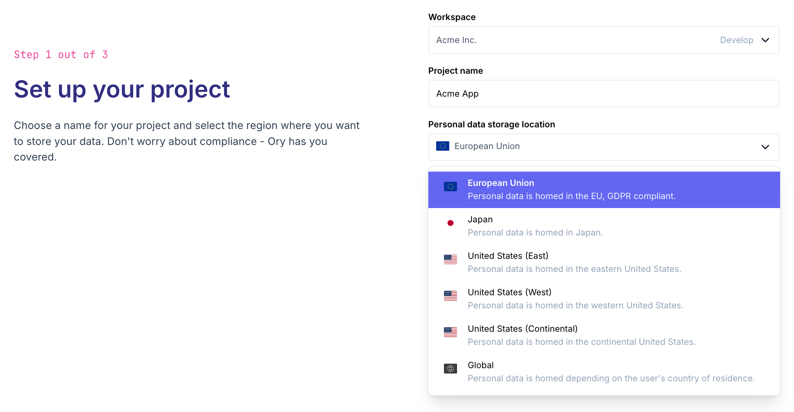
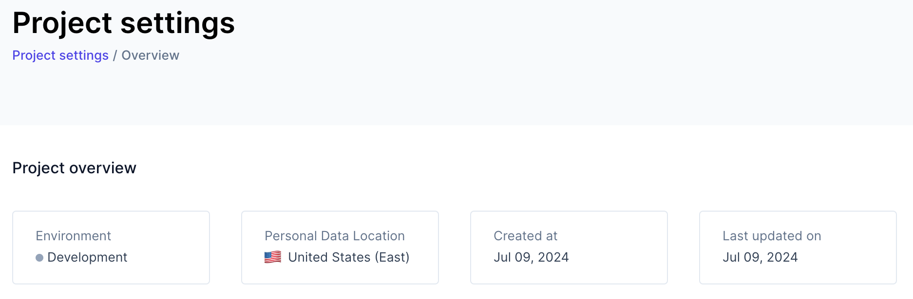

Ory Network is globally distributed for maximum resilience and minimum latency. Check out the
[blog post](https://www.ory.com/global-identity-and-access-management-multi-region/) for details on how this works.

As discussed in that blog post, replicating personal data (also known as personally identifiable data or PII) across the globe is
prohibited or made difficult by legislation like GDPR and would impede your user's control over their data.

Ory Network solves this by separating personal data from operational data. Personal data is any data concerning your users and
identities managed by Ory: think email addresses, names, phone numbers, device and location data, emails, etc. Operational data is
everything else: think "is this session or access token valid?" or "does the user with this anonymized ID have permission to
access file X?"

Ory Network globally replicates and makes available all operational data, giving you access with low latency based on the
geographical location of where the request originates.

Personal data in Ory Network is always homed to a particular region and stored only there. For users from the EU, their personal
data is stored on servers physically located in the EU. For users from the US, their personal data is stored in the US.

Ory Network handles this distinction for you transparently. You don't have to do anything to opt-in. Whatever data you query from
wherever you are located, Ory Network will combine any globally replicated operational data with regional personal data for you
automatically, reaching out behind the scenes to the region where that personal data is stored.

## Selecting a storage location for personal data

When you [create a new Ory Network project](https://console.ory.sh/projects/create) in the Ory Console, you are given a choice of
personal data storage location for your new project. Any personal data of your users and identities will be stored just in that
region, replicated within that region for availability and durability. Note that this choice is permanent for that project: moving
personal data between regions is an administrative action, with which Ory Support is happy to assist enterprise customers.

```mdx-code-block
import BrowserWindow from "@site/src/theme/BrowserWindow"

<BrowserWindow url="https://console.ory.sh/projects/create">



</BrowserWindow>
```

Your project's chosen personal data storage location is shown in the Ory Console.

```mdx-code-block
<BrowserWindow url="https://console.ory.sh/projects/current/settings">



</BrowserWindow>
```

## Global and US Continental storage locations

For enterprise customers, Ory offers the "Global" and "US Continental" personal data storage locations. This means personal data
is stored in the geographically closest location of the user's first signup. For the "Global" option, this spans any of Ory
Networks storage locations across the globe. "US Continental" means the user's personal data is stored in the geographically
closest storage location inside the contiguous United States.

We are working toward making it easy query and change personal data storage location on a per-identity basis via UI and API. If
this sounds interesting to you, please [reach out](https://www.ory.com/contact/) to discuss your use case.

## Regions and availability zones

When an identity's personal data is stored in a region, say US west, it is still highly available and replicated across at least
three availability zones within that region. Standard backup and disaster recovery plans are in place and regularly tested as
well. See [https://trust.ory.com/](https://trust.ory.com/) for details.
