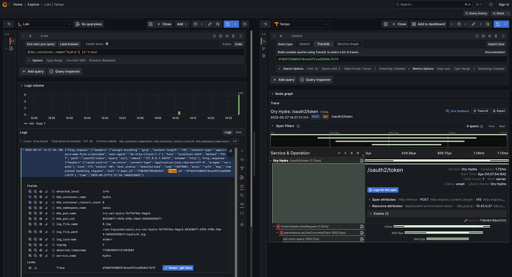

import CanonicalUrl from "@site/src/components/CanonicalUrl";

<CanonicalUrl path="/self-hosted/oel/monitoring" />

This guide presents exemplary monitoring configuration that will work with OEL applications.

## Prerequisites

In this document we assume your deployment is installed via Helm charts in a Kubernetes cluster. We present a basic monitoring
stack consisting of [Grafana](https://grafana.com/oss/grafana/), [Prometheus](https://prometheus.io/),
[Loki](https://grafana.com/oss/loki/), [Tempo](https://grafana.com/oss/tempo/) and
[OpenTelemetry Collector.](https://opentelemetry.io/docs/collector/)

To get started add following fields in your Helm value overrides:

```yaml
# use appropriate app name, one of:
[hydra|oathkeeper|kratos|keto]:
  config:
    tracing:
      provider: otel
      providers:
        otlp:
          insecure: true
          # go through otelcol for k8s metadata on traces
          server_url: opentelemetry-collector.default.svc.cluster.local:4318
serviceMonitor:
  enabled: true
```

You will also need following helm repositories:

```bash
helm repo add prometheus-community https://prometheus-community.github.io/helm-charts
helm repo add grafana https://grafana.github.io/helm-charts
helm repo add open-telemetry https://open-telemetry.github.io/opentelemetry-helm-charts
```

## Prometheus & Grafana

Install Helm chart
[`kube-prometheus-stack`](https://github.com/prometheus-community/helm-charts/tree/main/charts/kube-prometheus-stack) (managed by
[Prometheus Community](https://prometheus.io/community/)).

```yaml
grafana:
  # define datasources
  additionalDataSources:
    - access: proxy
      jsonData:
        nodeGraph:
          enabled: true
        serviceMap:
          datasourceUid: demo_prometheus
        tracesToLogsV2:
          customQuery: true
          datasourceUid: demo_loki
          filterByTraceID: true
          query: "{$${__tags}} |=`$${__span.traceId}`"
          spanEndTimeShift: 10m
          spanStartTimeShift: "-10m"
          tags:
            - key: k8s.pod.name
              value: k8s_pod_name
      name: Tempo
      type: tempo
      uid: demo_tempo
      url: http://tempo.default.svc.cluster.local:3200
    - access: proxy
      jsonData:
        derivedFields:
          - datasourceUid: demo_tempo
            matcherRegex: '"trace_id":"(\w+?)"'
            name: Trace
            url: $${__value.raw}
            urlDisplayLabel: Tempo - get trace
      name: Loki
      type: loki
      uid: demo_loki
      url: http://loki-gateway.default.svc.cluster.local:80
    - access: proxy
      jsonData:
        timeInterval: 30s
      name: Prometheus
      type: prometheus
      uid: demo_prometheus
      url: http://kube-prometheus-stack-prometheus.default.svc.cluster.local:9090
  grafana.ini:
    auth.anonymous:
      enabled: true
      org_role: Admin
  sidecar:
    datasources:
      # we already created Prometheus datasource with static UID
      defaultDatasourceEnabled: false
  testFramework:
    enabled: false
prometheus:
  # Prometheus Operator will ingest all ServiceMonitor objects found on cluster
  prometheusSpec:
    serviceMonitorSelectorNilUsesHelmValues: false
```

Please note details in YAML comments.

```bash
helm install kube-prometheus-stack prometheus-community/kube-prometheus-stack -f ./monitoring/prometheusValues.yaml
```

## Loki

Our Loki installation needs minimal configuration to run small in this demo.

```yaml
backend:
  replicas: 0
deploymentMode: SingleBinary
loki:
  auth_enabled: false
  commonConfig:
    # cannot be bigger than replica count
    replication_factor: 1
  storage:
    type: filesystem
  useTestSchema: true
minio:
  enabled: true
read:
  replicas: 0
singleBinary:
  replicas: 1
test:
  enabled: false
write:
  replicas: 0
```

```bash
helm install loki grafana/loki -f ./monitoring/lokiValues.yaml
```

## Tempo

Tempo requires no parameters to run as a single pod.

```bash
helm install tempo grafana/tempo
```

## OpenTelemetryCollector

```yaml
---
config:
  exporters:
    otlphttp/logs:
      endpoint: http://loki-gateway.default.svc.cluster.local:80/otlp
      tls:
        insecure: true
    otlphttp/traces:
      endpoint: http://tempo.default.svc.cluster.local:4318
      tls:
        insecure: true
  processors:
    # enrich traces with Kubernetes metadata
    k8sattributes:
      extract:
        metadata:
          - k8s.pod.name
  receivers:
    # consume Kubernetes node logs
    filelog:
      include:
        - /var/log/pods/*/*/*.log
      # needed for container operator
      include_file_path: true
      operators:
        # enrich logs with basic k8s metadata
        - type: container
    # receive traces over OpenTelemetry HTTP Protocol
    otlp:
      protocols:
        http:
          endpoint: 0.0.0.0:4318
  service:
    pipelines:
      logs:
        exporters:
          - otlphttp/logs
        receivers:
          - filelog
      traces:
        exporters:
          - otlphttp/traces
        processors:
          - k8sattributes
        receivers:
          - otlp
extraVolumeMounts:
  # volumeMount to consume node logs
  - mountPath: /var/log/pods
    name: varlogpods
    readOnly: true
extraVolumes:
  # volume to consume node logs
  - hostPath:
      path: /var/log/pods
    name: varlogpods
# chart requires this value to be set explicitly
image:
  repository: otel/opentelemetry-collector-k8s
# required to collect pod logs from all nodes
mode: daemonset
presets:
  # grant ServiceAccount permissions needed to enrich traces with Kubernetes metadata
  kubernetesAttributes:
    enabled: true
service:
  # create service that traces can be sent to; disabled by default in daemonset mode
  enabled: true
```

```bash
helm install opentelemetry-collector open-telemetry/opentelemetry-collector -f ./monitoring/otelcolValues.yaml
```

## Access

To access your Grafana instance, forward appropriate port:

```bash
kubectl -n default port-forward svc/kube-prometheus-stack-grafana 8080:80
```

You can now access [http://localhost:8080](http://localhost:8080). The metrics include application-specific data on top of data
reported by Kubernetes, and relation between traces and logs has been established (note blue buttons `Tempo - get trace` and
`Logs for this span` in screenshot).


