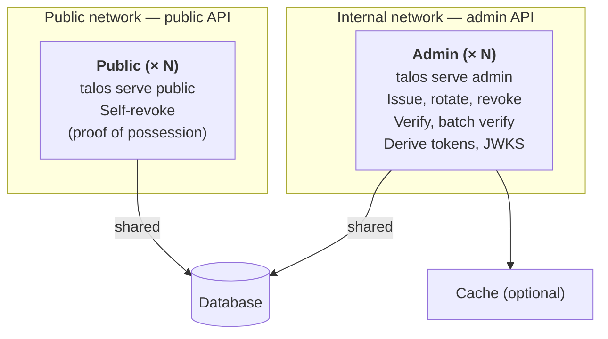

Ory Talos is a single binary with two HTTP surfaces:

- The **admin API** under `/v2alpha1/admin/*` — issue, get, list, update, rotate, revoke, import,
  derive tokens, **verify**, and **batch verify**.
- The **public API** under `/v2alpha1/apiKeys:selfRevoke` — proof-of-possession self-revocation.

The JWKS endpoint, `GET /v2alpha1/derivedKeys/jwks.json`, serves the public keys that verify derived
JWTs. Every mode exposes it, so callers can fetch it from either process.

In production, run them as two processes so each surface gets the right security posture and scaling
profile. Both processes share the same database and configuration.

## Why split

- **Admin needs authentication.** The admin API has no built-in auth. Any request that reaches it is
  treated as authorized. Bind it to an internal interface and place an authenticating proxy in
  front. See [Admin protection](../security/admin-protection.md).
- **Public does not.** The self-revoke endpoint validates proof of possession of the credential
  inline, so you can expose it to the public internet without an extra auth layer.
- **Independent scaling.** Verification is the hot path. Scale admin instances without touching the
  public process, and the reverse.

The split works in both the OSS and commercial editions. The subcommands are the same; only the
cache and database choices differ between editions.

## Modes

Each Ory Talos process runs in one of three modes selected by the subcommand:

| Subcommand           | API exposed                                                                                                                           |
| -------------------- | ------------------------------------------------------------------------------------------------------------------------------------- |
| `talos serve`        | Admin and public APIs in one process. Good for development and small deployments.                                                     |
| `talos serve admin`  | Admin API only — including `POST /v2alpha1/admin/apiKeys:verify` and `:batchVerify`. **Requires admin authentication.**               |
| `talos serve public` | Public API only — `POST /v2alpha1/apiKeys:selfRevoke`. **No admin authentication required**; proof of possession is validated inline. |

`talos serve admin` logs a startup warning that admin endpoints have no built-in authentication. Put
a trusted proxy or network boundary in front of it before sending traffic.

## Architecture



The public process is optional. Deploy it only if key holders need to revoke their own keys without
admin authentication. If you don't use `POST /v2alpha1/apiKeys:selfRevoke`, run the admin process
alone.

## Commands

```shell
# All-in-one — runs both APIs in one process. Good for development
# and small deployments.
talos serve --config config.yaml

# Admin API — bind to an internal address and require an authenticating
# proxy in front.
talos serve admin --config config.yaml

# Public API — exposes POST /v2alpha1/apiKeys:selfRevoke (and the JWKS endpoint).
talos serve public --config config.yaml
```

## Configuration

Both processes use the same configuration schema. The subcommand and bind address drive the split;
you don't strip config keys. Each process needs the full configuration block (`secrets`,
`credentials`, `db`, and the optional `cache`).

Use the same secrets on every process:

- `secrets.hmac.current` signs API key checksums and derives the macaroon root key. If it differs
  between processes, keys issued by one fail verification on another, and macaroons don't validate
  across processes.
- The pagination cursor key is derived from `secrets.hmac.current`, so sharing the HMAC secret keeps
  `next_page_token` values decodable across processes. There's no separate pagination secret to set.

### Admin process

Bind to an internal interface. Route the `/v2alpha1/admin/*` paths to this process from your
internal load balancer.

```yaml
serve:
  http:
    host: "10.0.0.1"
    port: 4420
credentials:
  issuer: "https://api.example.com"
secrets:
  hmac:
    current: "use-the-same-hmac-secret-on-every-process-or-verify-fails-64chars"
```

### Public process

Bind to a public-facing interface. Route `POST /v2alpha1/apiKeys:selfRevoke` (and, if you expose it,
the JWKS endpoint) to this process.

```yaml
serve:
  http:
    host: "0.0.0.0"
    port: 4420
credentials:
  issuer: "https://api.example.com"
secrets:
  hmac:
    current: "use-the-same-hmac-secret-on-every-process-or-verify-fails-64chars"
```

## Securing the admin process

Pick one of the patterns in [Admin protection](../security/admin-protection.md):

- Ory Network with API token policies on the admin paths.
- A reverse proxy (Envoy, NGINX, HAProxy, Caddy) that terminates TLS and validates client
  certificates.
- A managed API gateway (AWS API Gateway, Google Cloud API Gateway, Azure API Management) with an
  authorizer on `/v2alpha1/admin/*`.
- Internal-only network with security groups, firewall rules, or service-mesh policy.

Never expose `talos serve admin` directly to the public internet.

## Cache

The OSS edition supports only `cache.type: noop`. The `memory` and `redis` types require the
commercial edition. For multi-instance admin processes, use `redis` so revocations propagate across
nodes within one TTL.

## Keep verification on the admin surface

`POST /v2alpha1/admin/apiKeys:verify` and `:batchVerify` are admin endpoints. Verification is a
high-trust operation — it confirms whether a credential is valid and returns its metadata — so it
stays behind the same auth boundary as the rest of `/v2alpha1/admin/*`. Don't expose it to the
public internet. To verify keys close to untrusted clients without widening that boundary, run a
caching [edge proxy](./edge-proxy.mdx) that presents the same admin credentials as upstream. Only
`POST /v2alpha1/apiKeys:selfRevoke` is safe to expose publicly; see
[Expose only the self-service endpoint publicly](../../integrate/index.md#expose-only-the-self-service-endpoint-publicly).
