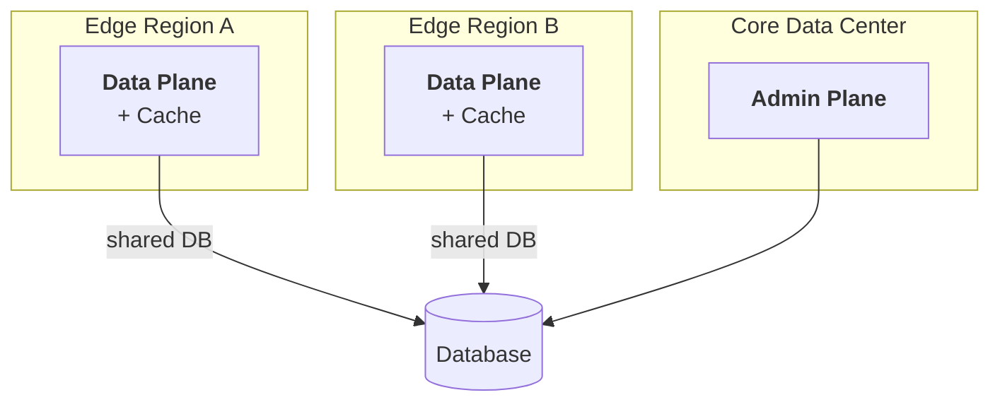
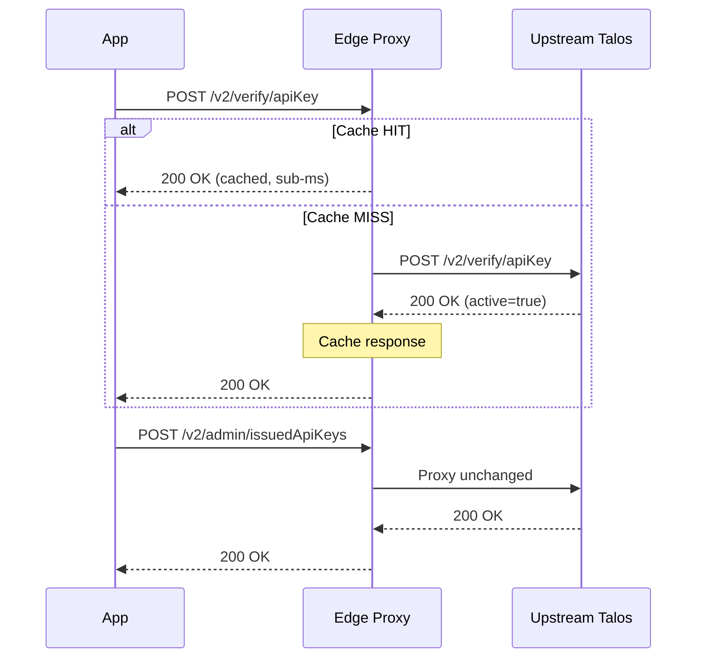

# Edge proxy

Deploy a caching reverse proxy as a sidecar to your application for sub-millisecond verification latency.

## Pattern



## Benefits

- Verification latency matches the distance to the nearest edge node
- Cache absorbs repeated lookups, reducing database load
- Admin operations remain centralized and secured

## How it works

The edge proxy is an HTTP reverse proxy that sits between your application and a central Talos server. It intercepts `POST`
requests to `/v2/verify/*` endpoints, caches positive (active) verification responses locally, and proxies everything else to
upstream unchanged.



Non-verify requests (admin operations, key issuance, health checks to upstream) pass through the proxy transparently.

## Sidecar deployment

Run the proxy as a sidecar container alongside your application. Your application sends verify requests to `localhost` (sub-ms
cache hits) instead of the central Talos server.

```
┌─────────────────────────────────┐
│  Pod / VM / Task                │
│                                 │
│  ┌───────────┐   ┌───────────┐ │
│  │    App    │──▶│   Proxy   │─┼──▶ Upstream Talos
│  │           │   │ :8080     │ │
│  └───────────┘   └───────────┘ │
└─────────────────────────────────┘
```

Point your application's Talos verify URL at `http://localhost:8080` (or whichever port the proxy listens on). All other Talos API
calls (admin, key management) should go directly to the central server.

## Configuration

Start the proxy with `talos-commercial proxy`:

```bash
talos-commercial proxy \
  --upstream http://talos-central:8080 \
  --listen :9090 \
  --cache-ttl 60s \
  --cache-max-size 104857600
```

| Flag                       | Default              | Description                                                                                                                         |
| -------------------------- | -------------------- | ----------------------------------------------------------------------------------------------------------------------------------- |
| `--upstream`               | _(required)_         | URL of the upstream Talos server.                                                                                                   |
| `--listen`                 | `:8080`              | Address and port the proxy listens on.                                                                                              |
| `--cache-ttl`              | `60s`                | Default TTL for cached verification responses.                                                                                      |
| `--cache-max-size`         | `104857600` (100 MB) | Maximum in-memory cache size in bytes.                                                                                              |
| `--cache-num-counters`     | `10000`              | Number of frequency counters for cache admission policy. Higher values improve hit rates for large working sets.                    |
| `--trust-x-forwarded-host` | `false`              | Use `X-Forwarded-Host` header for tenant-aware cache keys. Enable only when the proxy runs behind a trusted load balancer.          |
| `--allowed-hosts`          | _(none)_             | Comma-separated allowlist of valid `Host` / `X-Forwarded-Host` values. Requests with other hosts are rejected with `403 Forbidden`. |

## Cache behavior

### Cache key generation

Cache keys are derived from `SHA256(host + credential)` using length-prefixed encoding to prevent collision attacks. The host
component ensures tenant isolation in multi-tenant deployments: the same credential cached under `tenant-a.example.com` will not
be served for requests from `tenant-b.example.com`.

### What gets cached

Only responses that meet **all** of the following criteria are cached:

- The request is a `POST` to `/v2/verify/*`
- The upstream returned HTTP `200 OK`
- The response body contains `"is_active": true`

Inactive credentials, error responses, and non-verify endpoints are never cached.

### TTL calculation

The effective TTL for each entry is `min(configured_ttl, time_until_expires_at)`. If the verification response includes an
`expires_at` timestamp, the proxy ensures the cached entry expires no later than the credential itself. If `expires_at` is absent,
the configured `--cache-ttl` is used.

### Cache headers

Every response from the proxy includes an `Ory-Talos-Cache` header:

| Header value | Meaning                                                                        |
| ------------ | ------------------------------------------------------------------------------ |
| `HIT`        | Response served from local cache.                                              |
| `MISS`       | Response fetched from upstream (may have been cached for subsequent requests). |

### Cache bypass

Clients can bypass the cache by including a `Cache-Control` header:

```bash
curl -X POST http://localhost:8080/v2/verify/apiKey \
  -H "Content-Type: application/json" \
  -H "Cache-Control: no-cache" \
  -d '{"credential": "phx_..."}'
```

Both `no-cache` and `no-store` directives trigger a cache bypass. The response is still eligible for caching.

## Health checks

The proxy exposes the following health endpoints:

| Endpoint        | Behavior                                                                                                                                                                                   |
| --------------- | ------------------------------------------------------------------------------------------------------------------------------------------------------------------------------------------ |
| `/health/alive` | Always returns `200 OK`. Use as a liveness probe.                                                                                                                                          |
| `/health/ready` | Checks upstream connectivity by calling the upstream's `/health/alive` endpoint. Returns `200 OK` if upstream is reachable, `503 Service Unavailable` otherwise. Use as a readiness probe. |
| `/metrics`      | Prometheus metrics endpoint.                                                                                                                                                               |

## Proxy metrics

The proxy exposes Prometheus metrics under the `talos_proxy_` namespace:

| Metric                                 | Type      | Description                                                   |
| -------------------------------------- | --------- | ------------------------------------------------------------- |
| `talos_proxy_cache_hits_total`         | Counter   | Total number of cache hits.                                   |
| `talos_proxy_cache_misses_total`       | Counter   | Total number of cache misses.                                 |
| `talos_proxy_upstream_requests_total`  | Counter   | Requests forwarded to upstream, labeled by `status` code.     |
| `talos_proxy_upstream_latency_seconds` | Histogram | Latency of upstream requests.                                 |
| `talos_proxy_request_duration_seconds` | Histogram | Total request duration, labeled by `cached` (`true`/`false`). |

For general monitoring guidance, see [Metrics](../monitoring/metrics.md).

## Docker Compose sidecar example

```yaml
services:
  talos:
    image: oryd/talos-commercial:latest
    command: serve
    ports:
      - "8080:8080"
    environment:
      - DATABASE_URL=postgres://talos:secret@db:5432/talos?sslmode=disable

  proxy:
    image: oryd/talos-commercial:latest
    command: >
      proxy --upstream http://talos:8080 --listen :9090 --cache-ttl 60s
    ports:
      - "9090:9090"

  app:
    image: your-app:latest
    environment:
      # Verify requests go through the local proxy
      - TALOS_VERIFY_URL=http://proxy:9090
      # Admin requests go directly to the central server
      - TALOS_ADMIN_URL=http://talos:8080
    depends_on:
      - proxy
      - talos
```

## Kubernetes sidecar example

```yaml
apiVersion: v1
kind: Pod
metadata:
  name: app-with-talos-proxy
spec:
  containers:
    - name: app
      image: your-app:latest
      env:
        # Verify requests go through the localhost sidecar
        - name: TALOS_VERIFY_URL
          value: "http://localhost:9090"
        # Admin requests go directly to the central server
        - name: TALOS_ADMIN_URL
          value: "http://talos.talos-system.svc.cluster.local:8080"

    - name: talos-proxy
      image: oryd/talos-commercial:latest
      args:
        - proxy
        - --upstream
        - http://talos.talos-system.svc.cluster.local:8080
        - --listen
        - :9090
        - --cache-ttl
        - "60s"
      ports:
        - containerPort: 9090
          name: proxy
      livenessProbe:
        httpGet:
          path: /health/alive
          port: proxy
        initialDelaySeconds: 2
        periodSeconds: 10
      readinessProbe:
        httpGet:
          path: /health/ready
          port: proxy
        initialDelaySeconds: 5
        periodSeconds: 10
      resources:
        requests:
          memory: "64Mi"
          cpu: "50m"
        limits:
          memory: "256Mi"
          cpu: "200m"
```

## Eventual consistency

Revocation takes effect in the database immediately but cached verification results persist until the cache TTL expires. To force
an immediate re-check against upstream, send `Cache-Control: no-cache` on the verification request.

Choose a `--cache-ttl` that balances latency savings against your revocation propagation requirements. Shorter TTLs provide faster
revocation propagation at the cost of more upstream requests.
