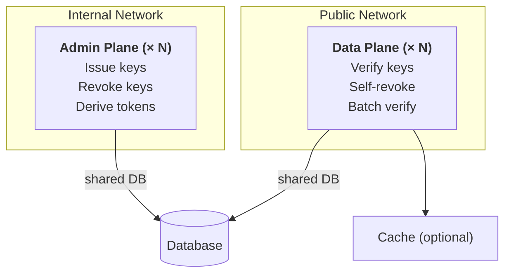

# Separate admin and data planes

In production, you can deploy the admin plane and data plane as separate processes for independent
scaling and security isolation.

## Why run them separately

- **Security**: Admin plane (write operations) stays internal; data plane (verification) can be
  exposed at the edge
- **Scaling**: Data plane handles high-throughput verification and scales horizontally; admin plane
  handles lower-volume management
- **Network isolation**: Admin plane behind internal firewall; data plane behind public load
  balancer

## Architecture

Both planes share the same database. The admin plane writes keys; the data plane reads and verifies
them.



## Commands

Talos provides separate subcommands for each plane:

```bash
# Run both planes in a single process (development/small deployments)
talos serve --config config.yaml

# Run only the admin plane (key management, token derivation)
talos serve admin --config config.yaml

# Run only the data plane (verification, self-revocation, caching)
talos serve check --config config.yaml
```

## Configuration

Both deployments use the same config file or environment variables. The key difference is network
exposure:

Both processes need the full configuration block (`secrets`, `credentials`,
`db`). The split is driven by the `serve` subcommand and the bind address, not
by stripping config keys.

**Admin plane** — bind to an internal address:

```yaml
serve:
  http:
    host: "10.0.0.1"
    port: 4420
credentials:
  issuer: "https://api.example.com"
secrets:
  default:
    current: "use-the-same-pagination-secret-on-both-planes--64chars"
  hmac:
    current: "use-the-same-hmac-secret-on-both-planes-or-verify-fails-64chars"
```

**Data plane** — bind to all interfaces with caching. Use the same secrets and
issuer as the admin plane so the two processes derive identical key checksums.
If you co-locate both planes on the same host, change one port (for example, the
admin plane on `4421`):

```yaml
serve:
  http:
    host: "0.0.0.0"
    port: 4420
credentials:
  issuer: "https://api.example.com"
secrets:
  default:
    current: "use-the-same-pagination-secret-on-both-planes--64chars"
  hmac:
    current: "use-the-same-hmac-secret-on-both-planes-or-verify-fails-64chars"
cache:
  type: "memory"
  ttl: "5m"
```

## Network policies

Restrict admin plane access to internal services only. Data plane can accept traffic from any
source.
