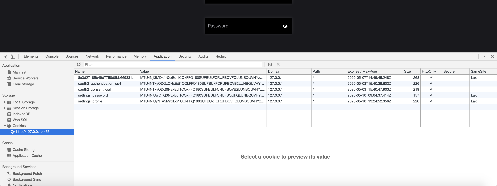
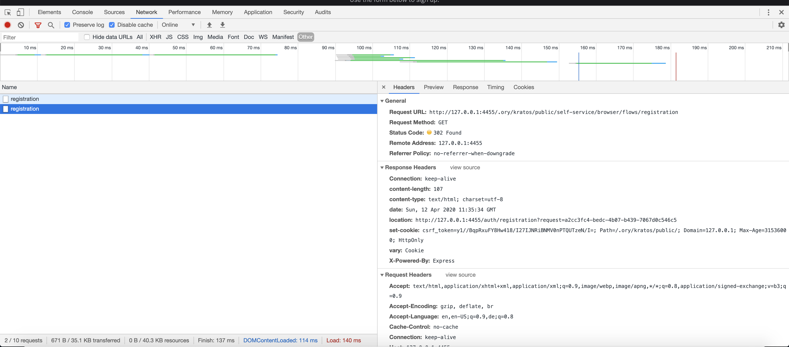

# CSRF troubleshooting

When you get `401 Unauthorized` or `400 Bad Request` responses when your application sends requests to Ory Identities APIs, it is
likely that the Ory anti-Cross-Site Request Forgery (CSRF) mechanisms are triggered.

This document describes common scenarios where you can face CSRF problems and gives advice for solving them.

:::tip

To learn more about CSRF and how Ory Identities protects against it, read the
[Ory threat models and security profile documentation](../kratos/concepts/security.mdx) and the
[OWASP attack description](https://owasp.org/www-community/attacks/csrf).

:::

To debug issues related to cookies or anti-CSRF defenses, use tools like the
[Chrome DevTools](https://developer.chrome.com/docs/devtools/). In Chrome DevTools, go to the **Application** tab and open the
**Cookies** section. Look for `Cookie` and `Set-Cookie` HTTP headers. Inspecting the **Network** tab and looking for the same
headers can also help you find the root cause of your problems.

:::info

Ory Identities uses HTTP cookies to store sessions when accessed via a browser.
[Learn more about the cookie-based security model in Ory.](../security-model.mdx)

:::

## Public Suffix Domains

If you're encountering a 403 `security_csrf_violation` error, it can be that you are using a domain that's on the
[public suffix list (PSL)](https://publicsuffix.org/). It's not possible to set cookies on a domain that's on the PSL. To fix
this, you need to use a sub-domain that's not on the PSL.

For example, you may encounter this error when using the `myftp.org` domain for your application. To resolve it, host your
application and API on separate sub-subdomains of `myftp.org` such as `app.myftp.org` and `ory.app.myftp.org`. Ensure that your
application's settings specify the cookie domain as `app.myftp.org` to restrict cookies to the appropriate sub-subdomain. This
configuration will help you bypass the limitations imposed by `myftp.org` being on the public suffix list, resolving the error and
allowing proper cookie functionality. After making these adjustments, test your application to ensure that the
`security_csrf_violation` error no longer occurs.

## Ory Identities

### Accessing cookies from client-side JavaScript

The cookies Ory Identities sets can't be accessed directly from client-side JavaScript because the `HttpOnly` flag is set. This
flag can't be modified.

### Accessing APIs from client-side JavaScript / AJAX

When building Single-Page Apps (SPAs) in Angular or React.js and you want the application to access the Ory Identities Public API
you need to configure your AJAX request to include cookies, because AJAX doesn't send cookies by default default.

For example, when using the browser's `fetch` function, you need to set
[`credentials: 'include'`](https://developer.mozilla.org/en-US/docs/Web/API/WindowOrWorkerGlobalScope/fetch#Parameters).

### Admin API URLs in local development

When you develop locally with [Ory Tunnel](../getting-started/local-development.mdx), Admin API endpoints such as
`/admin/recovery/link` and `/admin/recovery/code` return URLs that point to your project slug domain, for example
`https://{project-slug}.projects.oryapis.com/self-service/recovery?flow=...`. When a user opens one of these URLs in the browser,
the request goes to a different origin than your local application. This causes a CORS error that can surface as a
`401 Unauthorized` response or an unhandled error in the Ory SDK.

To fix this, replace the project slug domain in the URL with your Ory Tunnel URL before you send the link to users. For example,
replace `https://{project-slug}.projects.oryapis.com` with `http://localhost:4000`.

This applies to all flows that use Admin API-generated URLs in the browser, including the
[account recovery](../kratos/manage-identities/30_account-recovery.mdx) and
[invite users](../kratos/manage-identities/40_invite-users.mdx) flows.

### Accessing APIs from a server-side application

When building a server-side application, make sure to include the `Cookie` header from the client when fetching the self-service
flows, for example, `GET /self-service/login/flows?id=...`:

```ts
export default (req: Request, res: Response) => {
  // ...
  .getLoginFlow({ id: flow, cookie: req.header("cookie") })
}
```

A complete example looks as follows:

```mdx-code-block
import CodeFromRemote from "@site/src/theme/CodeFromRemote"

<CodeFromRemote
  lang="js"
  link="https://github.com/ory/kratos-selfservice-ui-node/blob/3e4eacea49763f455604fdbd5bea1f90b6f8fee7/src/routes/login.ts#L66"
  src="https://raw.githubusercontent.com/ory/kratos-selfservice-ui-node/master/src/routes/login.ts"
/>
```

Without forwarding the `Cookie` HTTP header you can't fetch the flow due to a security error. This prevents leaks of personal
information when users copy and paste, for example, the login URL.

## Ory OAuth2

Before starting to debug cookie and CSRF issues, make sure to check out the Chrome Developer Tools (or any comparable technology)
Cookies tabs in the Application tab



as well as the network tab - look for `Cookie` and `Set-Cookie` HTTP Headers:



### Running flows in separate browsers or browser windows

You are running the OAuth2 flow in separate browsers, or in a browser with incognito mode. The Brave browser is also known for
notoriously discarding cookies when used in "No-Tracking" mode.

### Running multiple OAuth2 flows simultaneously

You are trying to do two OAuth2 flows at the same time in the same Browser.

### Cookie same-site mode

You have changed the Cookie SameSite behavior. If this is the default value (you didn't change it), this shouldn't be an issue.

### Using AJAX to call `/oauth2/auth`

You **can't** call `/oauth2/auth` using an AJAX request. It isn't allowed and not possible with OAuth2. This endpoint can only be
accessed using a normal browser request by clicking a link or redirecting the end-user's browser to that endpoint.

## Further reading

Read [this document](../kratos/debug/csrf.mdx) for CRSF troubleshooting specific to self-hosted Ory Kratos Identity Server
instances.
