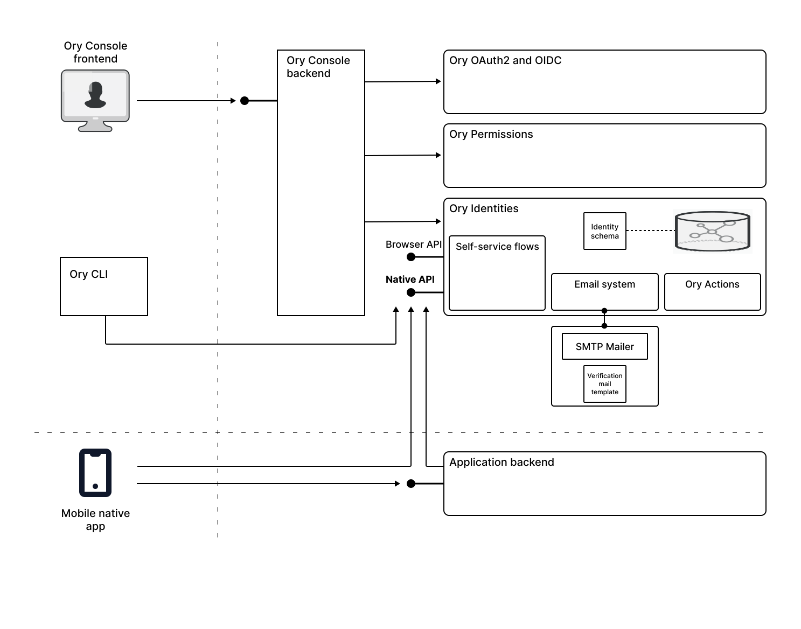
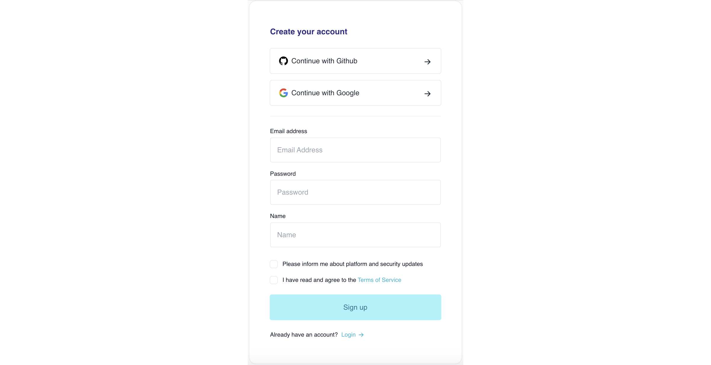

## Use case: ACME Corporation is new to security and wants to implement a straightforward authentication solution for their native app

ACME Corporation is building a new subscription-based service from scratch. In the first phase of the project, they implemented a
browser-based app that integrates with the authentication flows provided by Ory Network. Now they want to extend their coverage,
by implementing a native app that runs on the Android and iOS mobile platforms. For the initial release of the mobile app, they
want to include support for social sign-in, as their experience with the browser-based app suggests this will significantly boost
the rate of new user registrations.

## How Ory Network provides authentication for native apps

The first step ACME Corporation took was to learn about the architecture of Ory Network and how it could provide authentication
flows for their mobile native app. The following diagram illustrates how a native app integrates with the Ory Network's
self-service authentication flows and shows some of the main features of the authentication architecture:

### Self-service flows

To get started with the development of the mobile app and implement a proof of concept quickly, the main thing developers need to
know about at this point are the self-service flows.

Self-service flows refer to the flows that users perform themselves, providing the essence of the end user's experience. Ory
Identities implements the following self-service flows for native apps:

- [User login](https://www.ory.sh/docs/kratos/self-service/flows/user-login)
- [User registration](https://www.ory.sh/docs/kratos/self-service/flows/user-registration)
- [Profile management](https://www.ory.sh/docs/kratos/self-service/flows/user-settings)
- [Account verification](https://www.ory.sh/docs/kratos/self-service/flows/verify-email-account-activation)

From an application developer's perspective, these self-service flows are the main touch points for integrating the app with Ory
Network. In response to user interaction, the application developer initiates a self-service flow by calling an Ory API and Ory
Network then takes control of user interaction (for example, User Registration) until the flow completes. Allowing Ory Network to
orchestrate the self-service flows offers the following advantages to application developers:

- Application developers have less work to do, as Ory orchestrates the steps in the flow from beginning to end.
- The self-service flows from Ory incorporate specialist knowledge to protect against various attack vectors, which makes the app
  more secure. See [Self-service flows](https://www.ory.sh/docs/kratos/self-service).

### Social sign-in for native apps

ACME Corporation was particularly interested in the possibility of enabling social sign-in in the new mobile app, which would
enable users to sign in using their existing social media accounts such as Google, Facebook, and Microsoft. For example, after
enabling social sign-in for the ACME mobile app, users would be presented with a registration form like the following:

Where this form presents the user with three sign-up options:

- Sign up using a Github account
- Sign up using a Google account
- Register directly with the ACME mobile app

If the user already has an account with Github, for example, they could click the **Continue with Github button** to log in to
their Github account. After giving consent for the ACME mobile app to access a limited amount of personal data from Github,
registration completes automatically and the user gets access to the ACME mobile app.

From the user's perspective, this procedure is simpler and quicker, so they are much more likely to sign up using the social
sign-in flow.

## Implementing authentication for a native app

They decided to implement the following phased plan:

- [Start with a POC](#start-with-a-poc)
- [Elaborate and customize the app](#elaborate-and-customize-the-app)
- [Go to production](#go-to-production)

### Start with a POC

1. The app developer created a new project in Ory Console, choosing the US location for hosting PII data.

2. The app developer then quickly [installed the Ory CLI](https://www.ory.sh/docs/guides/cli/installation) to work with the new
   project. At this point, the app developer's environment was ready to start work on integrating the app with Ory Network.

3. The developer decided to build the POC for the mobile app using the [React Native](https://reactnative.dev/) framework, as this
   provides a platform-neutral framework for building mobile apps on Android and iOS. The developer soon located Ory's
   [React Native quickstart](https://www.ory.sh/docs/getting-started/integrate-auth/react-native), which could serve as a model
   for the POC.

4. The initial POC planned to support just three flows: account registration, login, and logout. Because the React Native
   quickstart already provides sample implementations of these authentication flows, this phase of the coding was completed
   quickly.

5. The app developer completed the POC ahead of schedule and successfully demonstrated the authentication flows to project
   managers at ACME Corporation.

### Extend and customize the app

At this point, the developer team at ACME Corporation was ready to extend the functionality of the app and customize the features
of Ory Network.

1. Adding the self-service account settings flow was a quick win for the developer team, because the React Native quickstart
   already provides a sample implementation for this.

2. The developer team also added the account verification flow to the app.

3. As ACME needed to add custom fields to the account registration form, the developer team decided to
   [customize the identity schema](https://www.ory.sh/docs/kratos/manage-identities/customize-identity-schema) for their project.

4. To support the account verification flow, they needed to integrate the Ory project with their email server. At this point, they
   called in their system administrator to perform the following tasks on Ory Console:

   - Customize the email template for the account verification flow.
   - Integrate the Ory project with their corporate SMTP email server.

5. ACME Corporation also enabled social sign-in for the initial rollout of their app.

### Go to production

Finally, ACME Corporation finished the development phase and were ready to go to production with their app.

1. Before going into production, ACME Corporation upgraded Ory Network to a paid subscription tier. The paid subscription tier is
   necessary to provide the level of scaling and support required for a production system. It is also a prerequisite for using a
   custom domain with the Ory Network project.

2. ACME Corporation started training their Help Desk staff on how to work with Ory Console and Ory CLI, so that the staff could
   provide assistance to users who might need help with their accounts.

3. ACME Corporation deployed their application backend to a highly scalable cloud infrastructure.

4. At this point, the configuration required for using Ory Network in production was complete and ACME Corporation started running
   tests on the production system, before going live.
