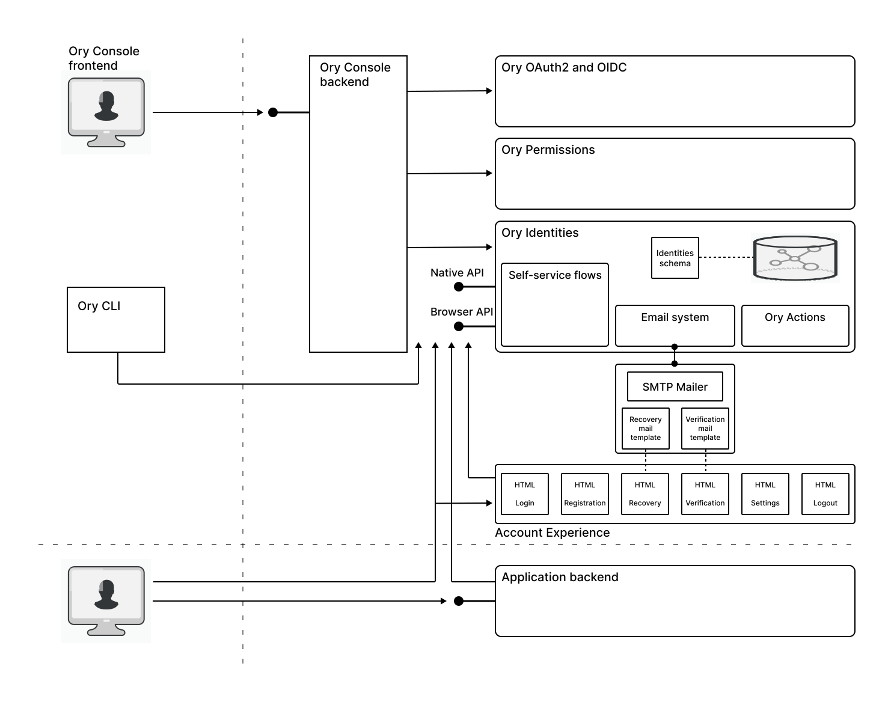

## Use case: ACME Corporation is new to security and wants to implement a straightforward authentication solution for their browser-based app

ACME Corporation is building a new subscription-based service from scratch.
To manage user accounts for their new service, they decided to create a browser-based app with self-service flows, such as account registration, login, and logout.
They initially tried to implement their own solution based on the [OAuth2](https://oauth.net/2/) and [OpenID Connect](https://openid.net/connect/) standards.
But before long, they found that implementing their own authentication solution was unexpectedly difficult and consumed too much of their developers' time.
At this point, they started looking for an off-the-shelf SaaS solution and turned to Ory for help.

## How Ory Network provides authentication for browser-based apps

The first step ACME Corporation took was to learn about the architecture of Ory Network and how it could provide authentication flows for their browser-based app.
The following diagram illustrates how a browser-based app integrates with the Ory Network's self-service authentication flows and shows some of the main features of the authentication architecture:

### Ory Identities, not OAuth2

ACME Corporation had initially attempted to implement authentication using OAuth2 and OpenID Connect standards, so they were surprised to learn that Ory's default identity management solution (Ory Identities) does not rely on OAuth2 and OpenID Connect for authentication.

In Ory Network, basic authentication capabilities (involving account registration, sign in, logout, and so on) are addressed by Ory Identities, not OAuth2 and OpenID Connect.
For an in-depth discussion about when to use OAuth2 and OpenID Connect, see [Why you probably do not need OAuth2 / OpenID Connect](https://www.ory.sh/oauth2-openid-connect-do-you-need-use-cases-examples/).

:::note

Ory Network also provides a fully-featured OAuth2 and OpenID Connect server, for the cases when it's really needed.

:::

### Cookie-based security

Given that Ory Identities is not based on OAuth2 and OpenID Connect, the project manager at ACME Corporation wanted to know what sort of security model Ory uses for browser-based apps?
The answer is given by Ory Identities' model of _cookie-based security_.

After a user signs in, Ory Identities returns a specialy configured HTTP cookie &mdash; an anti-[CSRF](https://owasp.org/www-community/attacks/csrf) cookie &mdash; which stores secure session data (including a user token) and protects the app from Cross Site Request Forgery (CSRF) attacks.
The anti-CSRF cookie is configured with the following flags, in order to achieve the maximum degree of security allowed by modern browsers:

- `secure`: The cookie is only sent over a HTTPS connection, to protect against man-in-the-middle attacks.
- `httpOnly`: The cookie is not available to JavaScript code, to protect against XSS.
- `sameSite=Strict`: The cookie can only be requested from the same origin, to protect against CSRF attacks.

This provides a model of security that is simple for app developers to use: API requests (over HTTP) are automatically accompanied by the secure HTTP cookie, giving access to the secure user session.
At the same time, the restrictions applied to the cookie ensure it is not accessible to bad actors and cannot be sent outside the app's domain.

### Self-service flows

At this point, the app developers at ACME Corporation began integrating their app with Ory Network.
They wanted to know which part of the Ory Identities API they could use to implement a proof of concept quickly.
It turns out that the main thing developers need to know about at this point are the _self-service flows_.

Self-service flows refer to the flows that users perform themselves, providing the essence of the end user's experience.
Ory Identities implements the following self-service flows:

- [User Login](https://www.ory.sh/docs/kratos/self-service/flows/user-login)
- [User Registration](https://www.ory.sh/docs/kratos/self-service/flows/user-registration)
- [Profile Management](https://www.ory.sh/docs/kratos/self-service/flows/user-settings)
- [Account Recovery](https://www.ory.sh/docs/kratos/self-service/flows/account-recovery-password-reset)
- [Account verification](https://www.ory.sh/docs/kratos/self-service/flows/verify-email-account-activation)

From an application developer's perspective, these self-service flows are the main touch points for integrating the app with Ory Network.
In response to user interaction, the application developer initiates a self-service flow by calling an Ory API and Ory Network then takes control of user interaction (for example, User Registration) until the flow completes.
Allowing Ory Network to orchestrate the self-service flows offers the following advantages to application developers:

- Application developers have less work to do, as Ory orchestrates the steps in the flow from beginning to end.
- The self-service flows from Ory incorporate specialist knowledge to protect against various attack vectors, which makes the app more secure. See [Self-service flows](https://www.ory.sh/docs/kratos/self-service).

### Ory Account Experience

For browser-based apps, the self-service flows are augmented by a complete browser-based UI experience, the Ory Account Experience.
In practice, this means that the HTML forms and pages needed for the self-service flows are already provided by Ory Network.

If you need to customize the HTML forms and pages provided by the default Account Experience, you have two options:

- **Theming**: Enables you to customize the look and feel of the Account Experience pages and add your own logo.
  This can be done directly in the Ory Console, without any coding required.
- **Bring your own UI**: Enables complete customization of the Account Experience pages.
  In this case, you need to re-implement the account UI screens, but this can be done more easily by leveraging [Ory Elements](https://github.com/ory/elements), which provides a library of components for building account UI screens.

### Advanced login and authentication features

ACME Corporation started out with some fairly modest goals for their authentication solution, while they were trying to implement the solution themselves.
After they turned to Ory Network, however, they realized they could easily leverage a variety of advanced login and authentication features that were not in their original plan.
For little effort they could enhance their authentication solution with any of the following features:

- Social sign-in
- Self-service account recovery
- Multi-factor authentication
- Biometric passkeys (replacing passwords)

As these features are all included in the basic Ory subscription plan, they can be evaluated and tested during the development phase.
ACME Corporation was particularly interested in the possibility of enabling social sign-in, which would enable users to sign in using their existing social media accounts such as Google, Facebook, and Microsoft.
As they are about to launch their subscription-based service for the first time, they believe this feature could enable them to grow their user base more quickly.

## Implementing authentication for a browser-based app

After spending so much time attempting to implement their own solution before turning to Ory, ACME Corporation needed an accelerated plan for integrating their app with Ory Network, in order to get back on schedule.
They decided to implement the following phased plan:

* [Start with a POC](#start-with-a-poc)
* [Elaborate and customize the app](#elaborate-and-customize-the-app)
* [Go to production](#go-to-production)

### Start with a POC

1. The first step was to [sign up](https://console.ory.sh/registration) with Ory Network, which immediately gave them access to the Ory Console and to Ory Identities running on the cloud.
   The free Developer tier had all of the features they needed for the trial, so they were able to get started on the POC right away. 
   
2. The app developer created a new project in Ory Console, choosing the US hosting location, which is conveniently located for ACME Corporation's base of operations.

3. The app developer then quickly [installed the Ory CLI](https://www.ory.sh/docs/guides/cli/installation) and [set up the Ory Tunnel](https://www.ory.sh/docs/guides/cli/proxy-and-tunnel) to work with the new project.
   At this point, the app developer's environment was ready to start work on integrating the app with Ory Network.

4. To get an idea of how to code with Ory's API, the developer started out by browsing Ory's [quickstart examples](https://www.ory.sh/docs/getting-started/overview).
   The developer soon located the single-page application [Next.js/React quickstart](https://github.com/ory/docs/tree/master/code-examples/protect-page-login/nextjs), which would serve as the model for integrating their app.

5. The initial (minimal) POC planned to support just three flows: account registration, login, and logout.
   Because Ory Network already provides complete implementations of these basic authentication flows, this phase of the coding was completed quickly.

6. The app developer completed the POC ahead of schedule and successfully demonstrated the authentication flows to project managers at ACME Corporation.  

### Elaborate and customize the app

At this point, the developer team at ACME Corporation were ready to extend the functionality of the app and customize the features of Ory Network.

1. The developer team added the account recovery and account verification flows to the app.
   Because Ory Network provides a complete default implementation of these flows, little coding was required.

2. Adding the self-service account settings flow was also a quick win for the developer team.

3. As ACME needed to add custom fields to the account registration form, the developer team decided to [customize the identity schema](https://www.ory.sh/docs/kratos/manage-identities/customize-identity-schema) for their project.

4. To customize the account experience, the developer team decided to apply their company branding with the **Theming** settings in the Ory Console.
   In the long run, they would like to redesign the account experience pages (for example, using Ory Elements), but **Theming** was a solution they could implement quickly, enabling them to stay on schedule.

5. To support the account recovery and account verification flows, they needed to integrate the Ory project with their email server.
   At this point, they called in their system administrator to perform the following tasks on Ory Console:
   - Customize the email templates for the account recovery and account verification flows.
   - Integrate the Ory project with their corporate SMTP email server.

6. The team at ACME Corporation decided to experiment with some of the advanced login and authentication features supported by Ory, to see which of these features they might like to adopt.

7. After experimenting with the authentication features, ACME Corporation decided to enable social sign-in for the initial rollout of their app, as they expect it will accelerate user registrations.

### Go to production

Finally, ACME Corporation finished the development phase and were ready to go to production with their app.

1. Before going into production, ACME Corporation upgraded Ory Network to a paid subscription tier.
   The paid subscription tier is necessary to provide the level of scaling and support required for a production system.

2. ACME Corporation started training their Help Desk staff on how to work with Ory Console and Ory CLI, so that the staff could provide assistance to users who might need help with their accounts.

3. ACME Corporation deployed their application backend to a highly scalable cloud infrastructure.
   At this stage, ACME contacted their domain name registrar to create the A records in DNS that map the IP addresses of their deployed servers to custom subdomains.

4. In order to integrate Ory Network properly with a production deployment, ACME Corporation needed to create a CNAME entry in DNS that maps a custom authentication subdomain (for example, `auth.<acme-domain>.com`) to the Ory project subdomain (for example, `<projectID>.projects.oryapis.com`) that is used with the app.
   See [Setting up a CNAME record](https://www.ory.sh/docs/guides/custom-domains#setting-up-a-cname-record).

5. After creating the CNAME record for the Ory project subdomain, the ACME system administrator went to the **Custom Domains** area of the Ory Console to configure the subdomain and CORS settings for the Ory project.
   See [Setup custom domains and CORS](https://www.ory.sh/docs/guides/custom-domains).

6. At this point, the configuration required for using Ory Network in production was complete and ACME Corporation started running tests on the production system, before going live.
