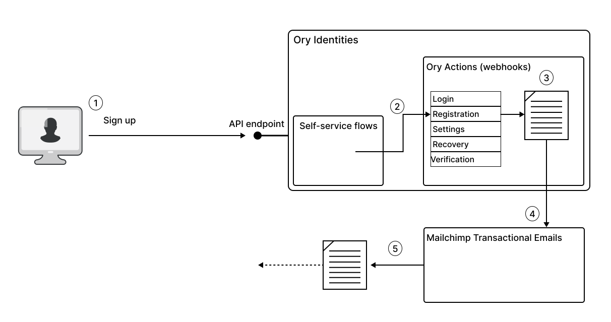
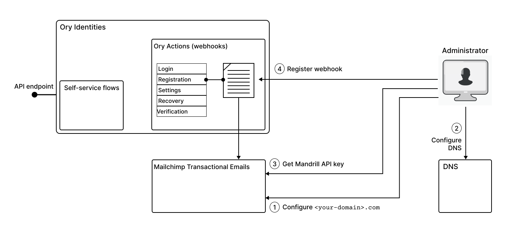

## Use case: Integrate Ory Actions with the Mailchimp Transactional Email system

[Mailchimp](https://www.mailchimp.com/) is an email marketing platform that provides tools and services to help businesses send
marketing emails, newsletters, and automated campaigns to their customers. It allows you to create, manage, and send emails to
your subscribers, as well as segment and target specific groups of subscribers based on their interests and behaviors.

There are two main subsystems of Mailchimp that are of interest:

- **Mailchimp email campaign tools** &mdash; available from the main Mailchimp dashboard, the campaign tools enable you to
  organize and manage mass mailings to specific audiences (subscriber lists).
- **Mailchimp Transactional Email** &mdash; available from the Mandrillapp dashboard, is an optional add-on for Mailchimp for
  managing _transactional emails_, which are user-specific emails sent to one user at a time.

In fact, it is the transactional email subsystem that is most relevant to the Ory integration use case. A transactional email is
an automated email message sent to an individual user, in response to some event or interaction with your application. For
example, when a user signs up to your website for the first time, this might trigger a welcome email to be sent to their email
address. This is where the integration with Ory comes in. You can configure Ory Actions (webhooks) to trigger transactional emails
in response any event that occurs in a self-service workflow (login, registration, account validation, and so on).

The advantage of integrating Ory with the Mailchimp Transactional Email system is that Mailchimp sends these emails on your behalf
and is able to track all of the transactional emails that pass through the system. You are then able to use the Mandrillapp
dashboard to track all of the ingoing and outgoing transactional emails and to generate reports and analytics for this email
traffic.

## How Ory integrates with Mailchimp

The following diagram illustrates how Ory integrates with the Mailchimp Transactional Email system. In this particular example, we
consider the case where a transactional email is triggered immediately after a user signs up (where Ory Identities is used to
manage the sign-up flow).

In this example, the transactional email is triggered as follows:

1. The end user signs up to a new account using Ory Identities, completing the registration self-service flow.
2. Upon completion, the registration flow triggers any actions registered under the `flows.registration.after.hooks` section of
   the identity configuration.
3. The hook for Mailchimp Transactional Email, registered under `flows.registration.after.hooks` is now triggered, and Ory
   evaluates the Jsonnet email template, personalizing the content with the user's name, email address, and so on.
4. The Ory action forwards the content of the email to Mailchimp by invoking an API endpoint on the Mailchimp Transactional Email
   system.
5. Mailchimp imports the email into its email system and then sends the transactional email to the end user _on behalf of your
   email domain_.

The last point about the email domain is important. For example, if you plan to send a transactional email that includes the
header `From: info@<your-domain>.com`, you need to configure Mailchimp so that it has the authority to send (and receive) emails
for the `<your-domain>.com` email domain. In other words, you need to configure Mailchimp as a mail server under your domain.

## Enabling webhooks for integration with Mailchimp

To enable the registration flow described above, a system administrator must first set up the integration with Mailchimp
Transactional Emails.

In outline, the main steps for setting up the integration are, as follows:

1. The system administrator goes to the Mailchimp Transactional Email dashboard and adds your domain, `<your-domain>.com`, as a
   sending domain. See
   [Add a sending domain](https://mailchimp.com/developer/transactional/guides/send-first-email/#add-a-sending-domain) in the
   Mailchimp developer documentation.
2. Next, the system administrator configures your DNS record, so that Mailchimp can act as a (trusted) email server in your
   domain. See [Configure your DNS](https://mailchimp.com/developer/transactional/guides/send-first-email/#configure-your-dns) in
   the Mailchimp developer documentation.
3. The system administrator generates a (Mandrill) API key, in order to authorize the Ory Action to access the Mandrill API,
   enabling Ory to forward transactional emails to Mailchimp. :::note

   A Mandrill API key is _not_ the same thing as a regular Mailchimp API key. You must generate the Mandrill API key from the
   [**Settings**](https://mandrillapp.com/settings) page on the Mailchimp Transactional Email system dashboard.

   :::

4. Using the API key from the previous step, the system administrator creates and registers an Ory Action for triggering a
   transactional email whenever a user completes the registration flow. See
   [Mailchimp integration with Ory Actions](https://www.ory.sh/docs/actions/integrations/mailchimp) in the Ory documentation.

Note the recent issue addresse by Arne, which is relevant to this use case: "The flows.registration.after.hooks section is used
only if the flows.registration.after.{password,oidc} sections are empty.

This was confusing to users, because by default we have the session hook in this section, which would then case the webhooks in
the "global" section to not be sent."
