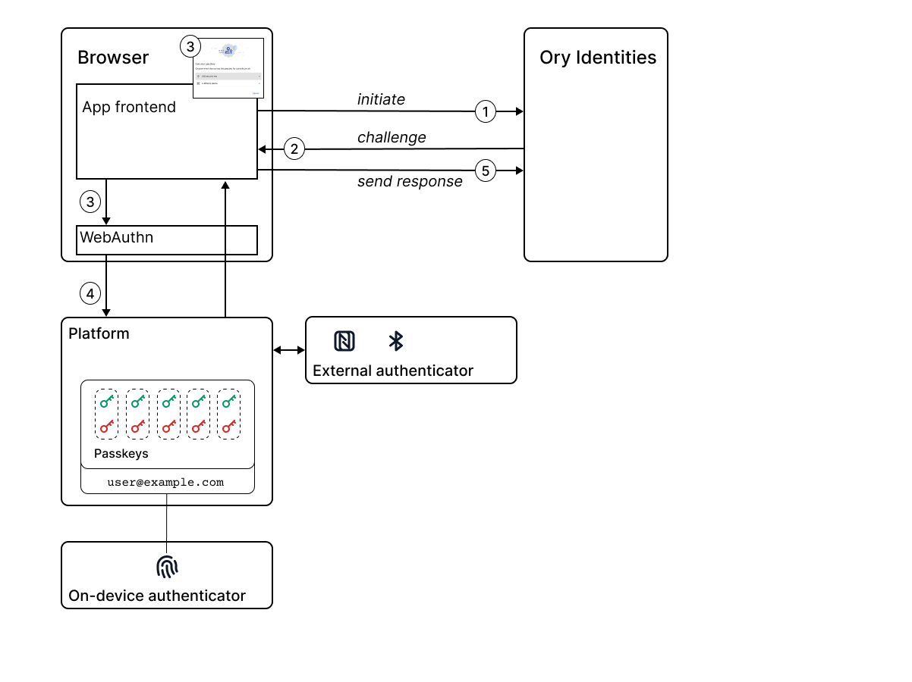

# Use case: Using passwordless authentication to protect against phishing attacks

ACME Corporation is considering the requirements for an authentication system that will integrate with their new browser-based
application. They would prefer to avoid using a traditional password-based solution because some of their app users were targeted
by phishing attacks in the past. They have heard about passwordless authentication as a potential solution that could protect
their system against phishing attacks, but they would like to understand more and learn how Ory supports this solution.

## How does Ory support passwordless authentication?

For browser-based apps, Ory supports passwordless authentication out of the box. Ory's self-service flows support passwordless
authentication by integrating with the
[W3C Web Authentication (WebAuthn) API](https://developer.mozilla.org/en-US/docs/Web/API/Web_Authentication_API) for browsers.
After enabling WebAuthn in an Ory project, the Ory Account Experience automatically presents passwordless as an option in the
registration and login flows. When developing your own authentication UI, the steps for integrating your application with the
passwordless registration and login flows is described
[in the documentation](https://www.ory.sh/docs/kratos/bring-your-own-ui/custom-ui-advanced-integration#passwordless-authentication).

Support for passkeys and passwordless varies, depending on whether you are using a browser-based app or a native app:

- For browser-based apps, passwordless works out of the box (leveraging WebAuthn).
- For native apps, you need to implement your own integration with the underlying platform, using the protocol defined in the
  CTAP2 specification.

Because passwordless is a relatively new technology, at the time of writing it has not yet been rolled out across all browsers and
platforms, but adoption is spreading rapidly. Very soon, passwordless authentication is expected to become available on all major
platforms and browsers. To check the current status of adoption, consult the FAQ on the
[FIDO Alliance](https://fidoalliance.org/passkeys/) website.

## What is passwordless authentication?

As the name implies, passwordless authentication is intended to replace traditional password-based authentication, enabling users
to verify their identity using authenticators bound to the device they are using&mdash;for example, biometric measurement.
Passkeys and passwordless authentication is a technology based on the specifications published by the
[FIDO Alliance](https://fidoalliance.org/), sponsored by software companies with an interest in security technology and standards.

There are two different classes of authenticators that can be used with passwordless:

- On-device authenticator &mdash; an authenticator available directly on the device you are using, for example fingerprint
  recognition on a mobile phone.
- External authenticator &mdash; an authenticator provided by an external device, such as a USB key or an NFC device.

### On-device authenticator for passwordless login flow

From the end user's perspective, passwordless login with an on-device authenticator is simple:

1. Ory's self-service login flow presents an option to log in using passwordless (below the option for signing in with a
   password). 
2. To sign in with passwordless, the user enters their ID and clicks the **Sign in with security key** button.
3. The Ory Account Experience displays the sign-in preparation dialog, which gives the user time to prepare the physical device
   for passwordless login. The user clicks **Continue** to proceed to the next step.
4. The platform verifies the user's identity using the chosen method.
5. Login/registration completes automatically.

### External authenticator for passwordless login flow

From the end user's perspective, passwordless login with an external authenticator is simple:

1. Ory's self-service login flow presents an option to log in using passwordless.
2. To sign in with passwordless, the user enters their ID and clicks the **Sign in with security key** button.
3. The Ory Account Experience displays the sign-in preparation dialog, which gives the user time to prepare the physical device
   for passwordless login. The user clicks **Continue** to proceed to the next step.
4. The user chooses the external authenticator to use for sign-in (for example, a USB security key).
   
5. The platform verifies the user's identity using the chosen method.
   
6. Login/registration completes automatically.

### Authenticator options for passwordless

Authenticators for passwordless are designed to be easy to use. For example, biometric authenticators are a popular option.

Here are some of the current authenticator options for passwordless:

- **On-device authenticators**
  - Fingerprint (Apple TouchID, Windows Hello)
  - Facial recognition (Apple FaceID, Windows Hello)
  - Iris scan (Windows Hello)
  - Voice recognition
  - Handwriting recognition
  - Device unlock
- **External authenticators**
  - USB key (YubiKey)
  - NFC devices
  - Bluetooth Low Energy (BLE) devices

### Resistance to phishing

The essential idea of a phishing attack is to trick a user somehow into giving up their password to the attacker, typically by
luring the user to a fake website where they are persuaded to log in, enabling the attacker to steal the password from the login
credentials.

The reason that passwordless is resistant to phishing is that secrets (passkeys, biometric data, and so on) are never passed to
web applications. Moreover, the user does not even have direct access to the passkeys and would not be able to send them to an
attacker.

## How does passwordless work?

Passwordless is not only easier to use, but also more secure than traditional password-based authentication. This might seem hard
to believe at first, given that security processes usually involve a trade-off between ease-of-use and increased security. But
passwordless authentication achieves this by building on the following insights:

- The device you are using (mobile phone or PC) already has built-in capabilities for verifying your identity. There should be no
  need to duplicate the procedure for identity verification (for example, by manually creating new passwords) when the platform
  already has this capability.
- Symmetric key authentication is an existing and proven technology, which has better security characteristics than password-based
  authentication. The problem with symmetric key authentication, however, is that until recently this method was hard to use. The
  FIDO alliance set itself the goal of automating symmetric key technology, making it more user friendly.

Consider the following diagram, which illustrates the passwordless-based login flow.

The main steps in the passwordless login flow are, as follows:

1. The frontend app detects that a user session is needed and sends a request to the application backend (server) to initiate
   authentication.
2. The server generates a challenge (consisting essentially of randomized data) and sends it back to the frontend app.
3. The frontend app requests identity verification through the browser API (WebAuthn), passing the challenge from the server and
   the ID that identifies this particular app (the _relying party ID_).
4. WebAuthn pops up a dialog in the browser, presenting the user with options for verifying their identity.
5. After the user selects a verification option, WebAuthn asks the platform (through the CTAP2 protocol) to verify the user's
   identity using the chosen authenticator.
6. The platform verifies the user identity using either:
   - An on-device authenticator
   - An external authenticator
7. If the user identity is verified, the platform retrieves the key pair for the application and uses the private key (passkey) to
   sign the challenge issued by the server.
8. The platform returns the signed response to the browser and the frontend app.
9. The frontend app returns the signed response to the server.
10. The server validates the signed reponse, using the public key from the user's account to verify the signature (where the
    user's public key was obtained during the passwordless sign-up flow).

:::note

Neither the public key nor the private key are exposed to the app during this authentication flow. The only time the public key is
sent over the network is during sign-up (registration flow), at which point the server stores the public key in the user's account
in the database. The corresponding passkey (private key) never leaves the keychain on the user's device.

:::

## How passkeys and passwordless are related

Passkey-based authentication and passwordless authentication are often talked about together. But if you are new to passwordless,
it's not always clear how these concepts are related.

At some level, passkeys are always involved in the passwordless authentication process, in one of the following ways:

- **Implicit use of passkeys** &mdash; for example, when a user authenticates using fingerprint recognition or face recognition,
  the platform implicitly creates a symmetric key pair, but this detail is hidden from the user.
- **Explicit use of passkeys** &mdash; for example, when a user authenticates using a USB key, which has a private key embedded in
  the physical USB key.

## Logging in with a passkey across multiple devices

If you need to log in with a passkey across multiple devices, the following options are supported by passwordless:

- One-off authentication using an external device
- Secure transfer of the passkey to the new device
- Platform specific passkey sharing between devices

### One-off authentication using an external device

Passkeys can also be used to perform login across devices. WebAuthn defines a protocol for performing passkey authentication
remotely over a (secured) BLE connection.

For example, consider the case where the passkey for a particular application is stored in the Android OS on your mobile phone. If
you need to log into the application from a PC, you can use the passkey on your mobile phone to verify your identity. In this
case, you would select a BLE (Bluetooth Low Energy) device as the external authenticator on the PC and, after pairing your phone
with the PC, you are prompted to verify your identity on the mobile phone. This authentication step is a one-off and, in
particular, the passkey **is not transferred to the PC**.

Using this remote authentication protocol, you can use your mobile phone as an external authenticator for any device that supports
WebAuthn, without leaving any trace of your credentials on that device.

### Secure transfer of the passkey to a new device

On the other hand, if you want to transfer passkey credentials from your mobile phone to your PC, this is also supported by the
FIDO standard. Support for this feature is not available on all platforms, however, as it is a recent addition to the standard.

For example, consider the case where a passkey for a particular appplication is stored on your mobile phone, but you also want to
have this passkey available on your personal laptop, so that you don't need to take out your phone every time you log in from your
laptop. If your platform has support for this, you see an option to securely transfer the passkey to your laptop, while performing
remote authentication over BLE. If you choose to transfer the passkey, it will be stored permanently (and securely) on your
laptop's OS and in future you will be able to log in to the application directly from your laptop.

### Platform specific passkey sharing between devices

If all of your devices belong to the same platform ecosystem (for example, Android, Apple, or Windows), you might find there is a
platform-specific mechanism available for sharing passkeys securely between devices. For example, the Apple iCloud keychain is
capable of sharing passkeys for passwordless login across multiple apple devices (assuming these devices have access to the same
Apple iCloud account).
