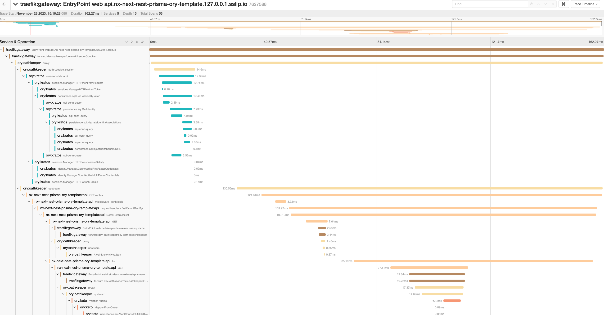

Configuring Distributed Tracing (DT) will enable you to obtain a visualization of the call paths that take place in order to
process a request made to Ory. It's yet another tool that you can use to aid you in profiling, debugging and ultimately
understanding your deployment of Ory better.

## Tracing options

You have the option to use a tracing backend or follow existing traces. Ory supports the following tracing backends:

- [OpenTelemetry](https://github.com/open-telemetry)
- [Jaeger](https://github.com/jaegertracing/jaeger)
- [Elastic APM](https://github.com/elastic/apm)
- [Datadog](https://github.com/DataDog)
- [Zipkin](https://github.com/openzipkin/zipkin)
- [Instana](https://www.instana.com/)

To follow existing traces: If you have deployed Ory behind a proxy that has initiated a trace, Ory will attempt to join that trace
by examining the request headers for tracing context.

### What an Ory trace includes

In DT speak, a trace is comprised of one or more spans which are logical units of work. Each Ory span is encapsulated with the
following state:

- A name
- A start time
- A finish time
- A set of zero or more tags

Ory creates the following spans:

- Top level span (_named after the request path_) for the requested endpoint. Span tags: - http method - http status code - error
  IFF status code >= 400
- Child span will be created if bcrypt (_e.g. when the token endpoint is called_) is called. Span tags: - bcrypt work factor
- All SQL database interactions. Spans/tags will vary depending on the database driver used.

This is still evolving and subject to change as tracing support continues to expand in Ory. If you see something that's
missing/wrong, please [create an issue](https://github.com/ory/docs/issues).

### Local setup

The [provided docker-compose file](https://github.com/ory/hydra/blob/master/quickstart-tracing.yml) in the Hydra repository (other
ory services have the same docker-compose file) has tracing configuration which you can use to play around with - just uncomment
the desired tracing provider. We will use Jaeger as an example.

Simply run

```sh
docker-compose -f quickstart.yml \
    -f quickstart-tracing.yml \
    up --build
```

Grab a coffee or stretch while you wait for everything to come up. You will then be able to navigate to the Jaeger UI which you
have exposed on port `16686` at http://localhost:16686/search. You can now start making requests and inspect traces!

As an example, here is a trace created by making a bad request to the `POST /clients` endpoint:


At a glance, you are able to see that:

- The request failed
- The request took ~80ms
- It resulted in a 409
- The hash comparison to validate the client's credentials took a whopping 70ms. Bcrypt is expensive!
- The various database operations performed

:::note

To see spans around database interactions, you must be using a SQL backend, such as MySQL or Postgres.

:::

There is a more complex example to show you the interactions between Kratos, Oathkeeper and Kratos to check if the user is allowed
the access the requested resource :



As previously said, you can see the interactions between the different services and SQL database interactions.

### Tracing configurations

You can configure tracing inside the configuration file (follow the same schema for all services) or via environment variables.

There is an example of a configuration file with tracing enabled:

```yaml
tracing:
  provider: jaeger # use any of the supported tracing providers
  service_name: ory:kratos # if not set, the service name will be the service's name
  providers:
    jaeger: # per provider configuration
      local_agent_address: jaeger:6831
      sampling:
        server_url: http://jaeger:5778/sampling
```

:::note

Please refer to the configuration reference for the full list of options.

:::

The CLI will also provide you with the list of tracing configurations and their supported values. Simply run:

```
docker exec -it hydra_hydra_1 hydra serve --help
```

And read the section on `DEBUG CONTROLS`.
