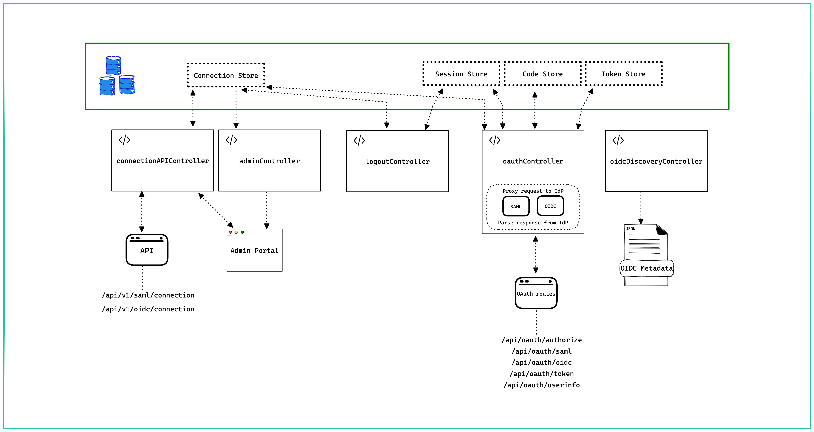

Ory Polis - formerly known as BoxyHQ Jackson - is an Enterprise Single Sign-On (SSO) service for SAML and OIDC identity providers.
It implements SSO as an OAuth 2.0 flow, abstracting away the complexities of the underlying SAML or OIDC protocol.

## Architecture

Ory Polis has been developed with a modular architecture. The business logic is separated into controllers which helps with
incremental adoption of features.

## Features

Ory Polis offers a range of features to simplify and secure enterprise SSO:

- SAML/OIDC Enterprise SSO: Implements Single Sign-On for SAML or OIDC Identity Providers, abstracting the underlying protocol
  complexities and making it easy to connect with various enterprise identity systems.
- OAuth 2.0 flow abstraction: Presents the SSO process as a standard OAuth 2.0 flow. Ideal for developers already familiar with
  OAuth 2.0 and OpenID Connect.
- Data ownership and control: As an open-source solution, Ory Polis allows you to host the service yourself, ensuring you maintain
  full control over your data and your customers' identity information.
- Flexible database support (BYOD): Supports a "Bring Your Own Database" model. This includes built-in compatibility for databases
  such as MySQL, MariaDB, Postgres, MongoDB, Redis, and PlanetScale, and works well with databases from major hosting providers.
- Modular design: Built with a modular architecture where business logic is separated into distinct controllers, enhancing
  flexibility, maintainability, and the ability to adopt features incrementally.

## Benefits

Using Ory Polis for your enterprise SSO needs provides key advantages:

- Simplify complex integrations: Reduce development effort by abstracting the intricacies of SAML/OIDC protocols. Interact with a
  familiar and straightforward OAuth 2.0 flow instead.
- Flexible and adaptable deployment: The open-source nature and BYOD support mean you can deploy Ory Polis in your preferred
  environment, to fit it to your existing infrastructure and operational needs.

## Use cases

Ory Polis is ideal for a variety of scenarios requiring enterprise-grade authentication:

- B2B application SSO: Allow users from your business customers to sign in to your multi-tenant SaaS application using their
  existing corporate SAML or OIDC identity providers (e.g., Okta, Azure AD, Google Workspace).
- Platform access for enterprise clients: Provide seamless and secure access for enterprise clients to your platform, enabling
  their employees to authenticate using their organization's credentials, thus improving user experience and security.
- Standardize authentication: Consolidate how different enterprise customers access your services, to reduce the complexity of
  managing multiple authentication systems.

## Next steps

- Visit the [Ory Polis GitHub repository](https://github.com/ory/polis).
- Engage with the community and maintainers through [GitHub Discussions](https://github.com/ory/polis/discussions) for questions
  and conversations.
- Join the [Ory Community Chat](https://slack.ory.com/) for discussions.
